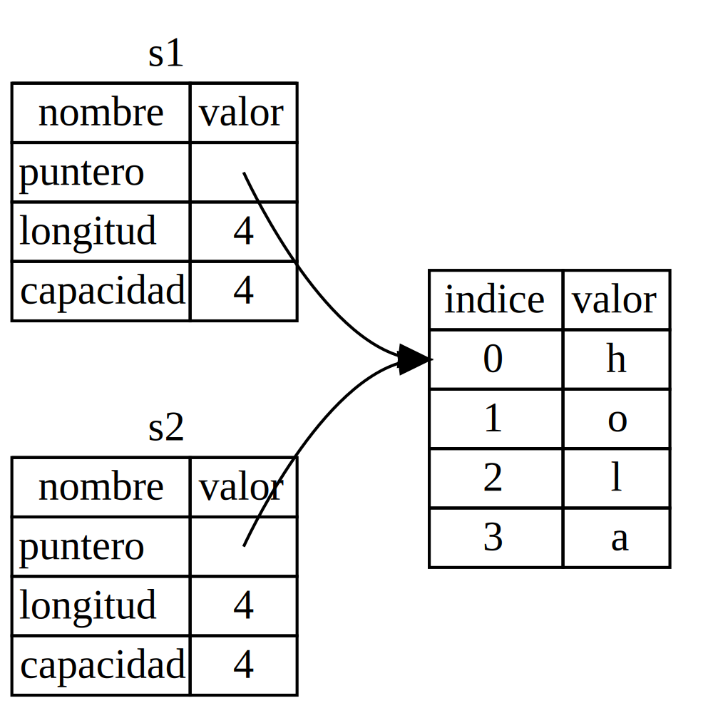

## What Is Ownership?

## ¿Qué es el Ownership?

*Ownership* is a set of rules that govern how a Rust program manages memory.
All programs have to manage the way they use a computer’s memory while running.
Some languages have garbage collection that regularly looks for no-longer-used
memory as the program runs; in other languages, the programmer must explicitly
allocate and free the memory. Rust uses a third approach: memory is managed
through a system of ownership with a set of rules that the compiler checks. If
any of the rules are violated, the program won’t compile. None of the features
of ownership will slow down your program while it’s running.

El *ownership* es un conjunto de reglas que gobiernan cómo un programa de Rust
administra la memoria. Todos los programas tienen que administrar la forma en
que usan la memoria de un computador mientras se ejecutan. Algunos lenguajes
tienen recolección de basura que busca regularmente la memoria que ya no se
usa mientras el programa se ejecuta; en otros lenguajes, el programador debe
asignar y liberar la memoria explícitamente. Rust usa un tercer enfoque: la
memoria se administra a través de un sistema de ownership con un conjunto de
reglas que el compilador verifica. Si alguna de las reglas se viola, el
programa no se compilará. Ninguna de las características del ownership
ralentizará su programa mientras se ejecuta.

Because ownership is a new concept for many programmers, it does take some time
to get used to. The good news is that the more experienced you become with Rust
and the rules of the ownership system, the easier you’ll find it to naturally
develop code that is safe and efficient. Keep at it!

Porque el ownership es un concepto nuevo para muchos programadores, toma un
tiempo acostumbrarse. La buena noticia es que a medida que se vuelva más
experimentado con Rust y las reglas del sistema de ownership, más fácil le
resultará desarrollar naturalmente código que sea seguro y eficiente. ¡Sigue
intentándolo!

When you understand ownership, you’ll have a solid foundation for understanding
the features that make Rust unique. In this chapter, you’ll learn ownership by
working through some examples that focus on a very common data structure:
strings.

Cuando entienda el ownership, tendrá una base sólida para comprender las
características que hacen que Rust sea único. En este capítulo, aprenderá
ownership trabajando en algunos ejemplos que se centran en una estructura de
datos muy común: las cadenas de caracteres.

> Nota:
> La traducción de Ownership seria "Propiedad", la mayor parte de la comunidad
> habla de este sistema como Ownsership pero también es valido este termino.
> El motivo es que el sistema de ownership es solo una analogía.
>
> La analogía es que el ownership es como la propiedad de un objeto, por ejemplo
> si tienes un libro, el libro es tuyo. Si lo prestas a alguien, el libro sigue
> siendo tuyo, pero ahora el libro esta en posesión de otra persona. Cuando
> devuelves el libro, el libro regresa a tu posesión. 

> ### The Stack and the Heap
>
> Many programming languages don’t require you to think about the stack and the
> heap very often. But in a systems programming language like Rust, whether a
> value is on the stack or the heap affects how the language behaves and why
> you have to make certain decisions. Parts of ownership will be described in
> relation to the stack and the heap later in this chapter, so here is a brief
> explanation in preparation.
>
> Both the stack and the heap are parts of memory available to your code to use
> at runtime, but they are structured in different ways. The stack stores
> values in the order it gets them and removes the values in the opposite
> order. This is referred to as *last in, first out*. Think of a stack of
> plates: when you add more plates, you put them on top of the pile, and when
> you need a plate, you take one off the top. Adding or removing plates from
> the middle or bottom wouldn’t work as well! Adding data is called *pushing
> onto the stack*, and removing data is called *popping off the stack*. All
> data stored on the stack must have a known, fixed size. Data with an unknown
> size at compile time or a size that might change must be stored on the heap
> instead.
>
> The heap is less organized: when you put data on the heap, you request a
> certain amount of space. The memory allocator finds an empty spot in the heap
> that is big enough, marks it as being in use, and returns a *pointer*, which
> is the address of that location. This process is called *allocating on the
> heap* and is sometimes abbreviated as just *allocating* (pushing values onto
> the stack is not considered allocating). Because the pointer to the heap is a
> known, fixed size, you can store the pointer on the stack, but when you want
> the actual data, you must follow the pointer. Think of being seated at a
> restaurant. When you enter, you state the number of people in your group, and
> the host finds an empty table that fits everyone and leads you there. If
> someone in your group comes late, they can ask where you’ve been seated to
> find you.
>
> Pushing to the stack is faster than allocating on the heap because the
> allocator never has to search for a place to store new data; that location is
> always at the top of the stack. Comparatively, allocating space on the heap
> requires more work because the allocator must first find a big enough space
> to hold the data and then perform bookkeeping to prepare for the next
> allocation.
>
> Accessing data in the heap is slower than accessing data on the stack because
> you have to follow a pointer to get there. Contemporary processors are faster
> if they jump around less in memory. Continuing the analogy, consider a server
> at a restaurant taking orders from many tables. It’s most efficient to get
> all the orders at one table before moving on to the next table. Taking an
> order from table A, then an order from table B, then one from A again, and
> then one from B again would be a much slower process. By the same token, a
> processor can do its job better if it works on data that’s close to other
> data (as it is on the stack) rather than farther away (as it can be on the
> heap).
>
> When your code calls a function, the values passed into the function
> (including, potentially, pointers to data on the heap) and the function’s
> local variables get pushed onto the stack. When the function is over, those
> values get popped off the stack.
>
> Keeping track of what parts of code are using what data on the heap,
> minimizing the amount of duplicate data on the heap, and cleaning up unused
> data on the heap so you don’t run out of space are all problems that ownership
> addresses. Once you understand ownership, you won’t need to think about the
> stack and the heap very often, but knowing that the main purpose of ownership
> is to manage heap data can help explain why it works the way it does.

> ### El Stack y el Heap
>
> Muchos lenguajes de programación no requieren que piense mucho en el stack y
> el heap. Pero en un lenguaje de programación de sistemas como Rust, si un
> valor está en el stack o en el heap afecta cómo el lenguaje se comporta y por
> qué debe tomar ciertas decisiones. Partes del ownership se describirán en
> relación con el stack y el heap más adelante en este capítulo, por lo que
> aquí hay una breve explicación en preparación.
>
> Tanto el stack como el heap son partes de la memoria disponible para su código
> para usar en tiempo de ejecución, pero están estructurados de formas
> diferentes. El stack almacena valores en el orden en que los recibe y elimina
> los valores en el orden opuesto. Esto se conoce como *último en, primero
> fuera*. Piense en una pila de platos: cuando agrega más platos, los coloca en
> la parte superior de la pila, y cuando necesita un plato, toma uno de la
> parte superior. Agregar o eliminar platos del medio o de la parte inferior no
> funcionaría tan bien! Agregar datos se llama *empujar en el stack*, y
> eliminar datos se llama *sacar del stack*. Todos los datos almacenados en el
> stack deben tener un tamaño conocido y fijo. Los datos con un tamaño
> desconocido en tiempo de compilación o un tamaño que puede cambiar deben
> almacenarse en el heap en su lugar.
>
> El heap es menos organizado: cuando coloca datos en el heap, solicita una
> cierta cantidad de espacio. El administrador de memoria encuentra un lugar
> vacío en el heap que sea lo suficientemente grande, lo marca como en uso y
> devuelve un *puntero*, que es la dirección de esa ubicación. Este proceso se
> llama *asignar en el heap* y a veces se abrevia como solo *asignar* (empujar
> valores en el stack no se considera asignar). Debido a que el puntero al heap
> es un tamaño conocido y fijo, puede almacenar el puntero en el stack, pero
> cuando desea los datos reales, debe seguir el puntero. Piense en estar sentado
> en un restaurante. Cuando ingresa, indica la cantidad de personas en su
> grupo, y el anfitrión encuentra una mesa vacía que quepa a todos y los lleva
> allí. Si alguien en su grupo llega tarde, puede preguntar dónde se ha
> sentado para encontrarlo.
>
> Empujar en el stack es más rápido que asignar en el heap porque el
> administrador de memoria nunca tiene que buscar un lugar para almacenar nuevos
> datos; esa ubicación siempre está en la parte superior de la pila. En
> comparación, asignar espacio en el heap requiere más trabajo porque el
> administrador de memoria debe encontrar primero un espacio lo suficientemente
> grande para contener los datos y luego realizar tareas administrativas para
> prepararse para la siguiente asignación.
>
> Acceder a los datos en el heap es más lento que acceder a los datos en el
> stack porque debe seguir un puntero para llegar allí. Los procesadores
> contemporáneos son más rápidos si saltan menos en la memoria. Continuando con
> la analogía, considere un servidor en un restaurante que toma pedidos de
> muchas mesas. Es más eficiente obtener todos los pedidos de una mesa antes de
> pasar a la siguiente mesa. Tomar un pedido de la mesa A, luego un pedido de la
> mesa B, luego uno de la A nuevamente y luego uno de la B nuevamente sería un
> proceso mucho más lento. Del mismo modo, un procesador puede hacer su trabajo
> mejor si trabaja con datos que están cerca de otros datos (como lo están en
> el stack) en lugar de más lejos (como pueden estar en el heap).
>
> Cuando su código llama a una función, los valores que se pasan a la función
> (incluidos, posiblemente, punteros a datos en el heap) y las variables locales
> de la función se empujan en el stack. Cuando la función termina, esos valores
> se sacan del stack.
>
> Mantener un registro de qué partes del código están utilizando qué datos en
> el heap, minimizar la cantidad de datos duplicados en el heap y limpiar los
> datos no utilizados en el heap para que no se quede sin espacio son todos
> problemas que ownership aborda. Una vez que comprenda ownership, no tendrá
> que pensar mucho en el stack y el heap, pero saber que el principal propósito
> de ownership es administrar datos en el heap puede ayudar a explicar por qué
> funciona de la manera en que lo hace.

### Ownership Rules

### Reglas de Ownership

First, let’s take a look at the ownership rules. Keep these rules in mind as we
work through the examples that illustrate them:

Primero, echemos un vistazo a las reglas de ownership. Mantenga estas reglas en
mente mientras trabajamos a través de los ejemplos que las ilustran:

* Each value in Rust has an *owner*.
* There can only be one owner at a time.
* When the owner goes out of scope, the value will be dropped.

* Cada valor en Rust tiene un *propietario*.
* Solo puede haber un propietario a la vez.
* Cuando el propietario sale del alcance, el valor se descartará.

### Variable Scope

### Ambito de las Variables

Now that we’re past basic Rust syntax, we won’t include all the `fn main() {`
code in examples, so if you’re following along, make sure to put the following
examples inside a `main` function manually. As a result, our examples will be a
bit more concise, letting us focus on the actual details rather than
boilerplate code.

Ahora que hemos pasado la sintaxis básica de Rust, no incluiremos todo el código
`fn main() {` en los ejemplos, por lo que si está siguiendo, asegúrese de
colocar los siguientes ejemplos dentro de una función `main` manualmente. Como
resultado, nuestros ejemplos serán un poco más concisos, permitiéndonos
centrarnos en los detalles reales en lugar del código de la caldera.

As a first example of ownership, we’ll look at the *scope* of some variables. A
scope is the range within a program for which an item is valid. Take the
following variable:

Como primer ejemplo de ownership, veremos el *ambito* de algunas variables.
Un ámbito es el rango dentro de un programa para el que un elemento es válido.
Toma la siguiente variable:

```rust
let s = "hello";
```

The variable `s` refers to a string literal, where the value of the string is
hardcoded into the text of our program. The variable is valid from the point at
which it’s declared until the end of the current *scope*. Listing 4-1 shows a
program with comments annotating where the variable `s` would be valid.

La variable `s` se refiere a un literal de cadena, donde el valor de la cadena
está codificado en el texto de nuestro programa. La variable es válida desde el
punto en que se declara hasta el final del *ambito* actual. El listado 4-1
muestra un programa con comentarios que anotan dónde sería válida la variable
`s`.

```rust
{{#rustdoc_include ../listings/ch04-understanding-ownership/listing-04-01/src/main.rs:here}}
```

<span class="caption">Listing 4-1: A variable and the scope in which it is
valid</span>

<span class="caption">Listado 4-1: Una variable y el ámbito en el que es
válida</span>

In other words, there are two important points in time here:

En otras palabras, hay dos puntos importantes en el tiempo aquí:

* When `s` comes *into* scope, it is valid.
* It remains valid until it goes *out of* scope.

* Cuando `s` entra en *ambito*, es válido.
* Permanece válido hasta que sale de *ambito*.

At this point, the relationship between scopes and when variables are valid is
similar to that in other programming languages. Now we’ll build on top of this
understanding by introducing the `String` type.

En este punto, la relación entre los ámbitos y cuándo las variables son válidas
es similar a la de otros lenguajes de programación. Ahora construiremos sobre
este entendimiento al introducir el tipo `String`.

### The `String` Type

### El Tipo `String`

To illustrate the rules of ownership, we need a data type that is more complex
than those we covered in the [“Data Types”][data-types]<!-- ignore --> section
of Chapter 3. The types covered previously are of a known size, can be stored
on the stack and popped off the stack when their scope is over, and can be
quickly and trivially copied to make a new, independent instance if another
part of code needs to use the same value in a different scope. But we want to
look at data that is stored on the heap and explore how Rust knows when to
clean up that data, and the `String` type is a great example.

Para ilustrar las reglas de ownership, necesitamos un tipo de datos más complejo
que los que cubrimos en la sección [“Tipos de Datos”][data-types]<!-- ignore -->
del Capítulo 3. Los tipos cubiertos anteriormente son de un tamaño conocido,
pueden almacenarse en el stack y se pueden sacar del stack cuando su ámbito
termina, y se pueden copiar rápidamente y trivialmente para crear una nueva
instancia independiente si otra parte del código necesita usar el mismo valor
en un ámbito diferente. Pero queremos ver los datos que se almacenan en el heap
y explorar cómo Rust sabe cuándo limpiar esos datos, y el tipo `String` es un
gran ejemplo.

We’ll concentrate on the parts of `String` that relate to ownership. These
aspects also apply to other complex data types, whether they are provided by
the standard library or created by you. We’ll discuss `String` in more depth in
[Chapter 8][ch8]<!-- ignore -->.

Nos centraremos en las partes de `String` que se relacionan con el ownership.
Estos aspectos también se aplican a otros tipos de datos complejos, ya sean
suministrados por la biblioteca estándar o creados por usted. Discutiremos
`String` con más profundidad en el [Capítulo 8][ch8]<!-- ignore -->.

We’ve already seen string literals, where a string value is hardcoded into our
program. String literals are convenient, but they aren’t suitable for every
situation in which we may want to use text. One reason is that they’re
immutable. Another is that not every string value can be known when we write
our code: for example, what if we want to take user input and store it? For
these situations, Rust has a second string type, `String`. This type manages
data allocated on the heap and as such is able to store an amount of text that
is unknown to us at compile time. You can create a `String` from a string
literal using the `from` function, like so:

Ya hemos visto literales de cadena, donde un valor de cadena está codificado en
nuestro programa. Los literales de cadena son convenientes, pero no son
adecuados para todas las situaciones en las que podríamos querer usar texto.
Una razón es que son inmutables. Otra es que no todos los valores de cadena se
pueden conocer cuando escribimos nuestro código: ¿y si queremos tomar la
entrada del usuario y almacenarla? Para estas situaciones, Rust tiene un segundo
tipo de cadena, `String`. Este tipo administra datos asignados en el heap y,
como tal, es capaz de almacenar una cantidad de texto que no conocemos en el
tiempo de compilación. Puede crear un `String` a partir de un literal de cadena
usando la función `from`, así:

```rust
let s = String::from("hello");
```

The double colon `::` operator allows us to namespace this particular `from`
function under the `String` type rather than using some sort of name like
`string_from`. We’ll discuss this syntax more in the [“Method
Syntax”][method-syntax]<!-- ignore --> section of Chapter 5, and when we talk
about namespacing with modules in [“Paths for Referring to an Item in the
Module Tree”][paths-module-tree]<!-- ignore --> in Chapter 7.

El operador doble dos puntos `::` nos permite usar el namespace (nombre
de espacio) de esta función `from` particular bajo el tipo `String` en lugar
de usar algún tipo de nombre como `string_from`. Discutiremos esta sintaxis
más en la sección [“Sintaxis de Método”][method-syntax]<!-- ignore --> del
Capítulo 5, y cuando hablamos sobre el uso de namespaces con módulos en
[“Rutas para Referir a un Elemento en el Árbol de Módulos”][paths-module-tree]<!-- ignore -->


This kind of string *can* be mutated:

Este tipo de cadena *puede* ser mutable:

```rust
{{#rustdoc_include ../listings/ch04-understanding-ownership/no-listing-01-can-mutate-string/src/main.rs:here}}
```

So, what’s the difference here? Why can `String` be mutated but literals
cannot? The difference is in how these two types deal with memory.

Entonces, ¿cuál es la diferencia aquí? ¿Por qué `String` puede ser mutable pero
los literales no pueden? La diferencia está en cómo estos dos tipos manejan la
memoria.

### Memory and Allocation

### Memoria y Asignación

In the case of a string literal, we know the contents at compile time, so the
text is hardcoded directly into the final executable. This is why string
literals are fast and efficient. But these properties only come from the string
literal’s immutability. Unfortunately, we can’t put a blob of memory into the
binary for each piece of text whose size is unknown at compile time and whose
size might change while running the program.

En el caso de un literal de cadena, conocemos los contenidos en tiempo de
compilación, por lo que el texto está codificado directamente en el ejecutable
final. Es por eso que los literales de cadena son rápidos y eficientes. Pero
estas propiedades solo vienen de la inmutabilidad del literal de cadena.
Desafortunadamente, no podemos poner un blob de memoria en el binario para
cada pieza de texto cuyo tamaño es desconocido en tiempo de compilación y cuyo
tamaño puede cambiar mientras se ejecuta el programa.

With the `String` type, in order to support a mutable, growable piece of text,
we need to allocate an amount of memory on the heap, unknown at compile time,
to hold the contents. This means:

Con el tipo `String`, para poder soportar una pieza mutable y extensible de
texto, necesitamos asignar una cantidad de memoria en el heap, desconocida en
tiempo de compilación, para contener el contenido. Esto significa:

* The memory must be requested from the memory allocator at runtime.
* We need a way of returning this memory to the allocator when we’re done with
  our `String`.

* La memoria debe solicitarse al administrador de memoria en tiempo de ejecución.
* Necesitamos una forma de devolver esta memoria al administrador cuando
  terminemos con nuestro `String`.

That first part is done by us: when we call `String::from`, its implementation
requests the memory it needs. This is pretty much universal in programming
languages.

Esa primera parte la hacemos nosotros: cuando llamamos a `String::from`, su
implementación solicita la memoria que necesita. Esto es prácticamente
universal en los lenguajes de programación.

However, the second part is different. In languages with a *garbage collector
(GC)*, the GC keeps track of and cleans up memory that isn’t being used
anymore, and we don’t need to think about it. In most languages without a GC,
it’s our responsibility to identify when memory is no longer being used and to
call code to explicitly free it, just as we did to request it. Doing this
correctly has historically been a difficult programming problem. If we forget,
we’ll waste memory. If we do it too early, we’ll have an invalid variable. If
we do it twice, that’s a bug too. We need to pair exactly one `allocate` with
exactly one `free`.

Sin embargo, la segunda parte es diferente. En los lenguajes con un *recolector
de basura (Garbage Collector)*, el recolector de basura rastrea y limpia la
memoria que ya no se está usando y no necesitamos pensar en ello. En la mayoría
de los lenguajes sin un GC, es nuestra responsabilidad identificar cuándo la
memoria ya no se está usando y llamar al código para liberarla explícitamente,
tal como lo hicimos para solicitarla. Hacer esto correctamente ha sido
históricamente un problema difícil de programación. Si lo olvidamos,
desperdiciaremos memoria. Si lo hacemos demasiado pronto, tendremos una variable
inválida. Si lo hacemos dos veces, eso también es un error. Necesitamos
emparejar exactamente una `asignación` con exactamente una `liberación`.

Rust takes a different path: the memory is automatically returned once the
variable that owns it goes out of scope. Here’s a version of our scope example
from Listing 4-1 using a `String` instead of a string literal:

Rust toma un camino diferente: la memoria se devuelve automáticamente una vez
que la variable que la posee sale del alcance. Aquí hay una versión de nuestro
ejemplo de alcance de la Lista 4-1 usando un `String` en lugar de un literal
de cadena:

```rust
{{#rustdoc_include ../listings/ch04-understanding-ownership/no-listing-02-string-scope/src/main.rs:here}}
```

There is a natural point at which we can return the memory our `String` needs
to the allocator: when `s` goes out of scope. When a variable goes out of
scope, Rust calls a special function for us. This function is called
[`drop`][drop]<!-- ignore -->, and it’s where the author of `String` can put
the code to return the memory. Rust calls `drop` automatically at the closing
curly bracket.

Hay un punto natural en el que podemos devolver la memoria que necesita nuestro
`String` al administrador: cuando `s` sale del alcance. Cuando una variable
sale del alcance, Rust llama a una función especial para nosotros. Esta
función se llama [`drop`][drop]<!-- ignore -->, y es donde el autor de `String`
puede poner el código para devolver la memoria. Rust llama a `drop`
automáticamente en la llave de cierre.

> Note: In C++, this pattern of deallocating resources at the end of an item’s
> lifetime is sometimes called *Resource Acquisition Is Initialization (RAII)*.
> The `drop` function in Rust will be familiar to you if you’ve used RAII
> patterns.

> Nota: En C++, este patrón de desasignación de recursos al final de la vida
> útil de un elemento a veces se denomina *Resource Acquisition Is
> Initialization (RAII)*. La función `drop` en Rust será familiar para usted si
> ha utilizado patrones RAII.

This pattern has a profound impact on the way Rust code is written. It may seem
simple right now, but the behavior of code can be unexpected in more
complicated situations when we want to have multiple variables use the data
we’ve allocated on the heap. Let’s explore some of those situations now.

Este patrón tiene un profundo impacto en la forma en que se escribe el código
Rust. Puede parecer simple ahora, pero el comportamiento del código puede ser
inesperado en situaciones más complejas cuando queremos que varias variables
usen los datos que hemos asignado en el heap. Exploremos algunas de esas
situaciones ahora.

<!-- Old heading. Do not remove or links may break. -->
<a id="ways-variables-and-data-interact-move"></a>

#### Variables and Data Interacting with Move

#### Variables y datos interactuando con Move

Multiple variables can interact with the same data in different ways in Rust.
Let’s look at an example using an integer in Listing 4-2.

Varias variables pueden interactuar con los mismos datos de diferentes formas
en Rust. Veamos un ejemplo usando un entero en la Lista 4-2.

```rust
{{#rustdoc_include ../listings/ch04-understanding-ownership/listing-04-02/src/main.rs:here}}
```

<span class="caption">Listing 4-2: Assigning the integer value of variable `x`
to `y`</span>

<span class="caption">Lista 4-2: Asignando el valor entero de la variable `x`
a `y`</span>

We can probably guess what this is doing: “bind the value `5` to `x`; then make
a copy of the value in `x` and bind it to `y`.” We now have two variables, `x`
and `y`, and both equal `5`. This is indeed what is happening, because integers
are simple values with a known, fixed size, and these two `5` values are pushed
onto the stack.

Podemos adivinar lo que está haciendo: "vincular el valor `5` a `x`; luego
hacer una copia del valor en `x` y vincularlo a `y`". Ahora tenemos dos
variables, `x` y `y`, y ambos son `5`. Esto es lo que está sucediendo, porque
los enteros son valores simples con un tamaño conocido y fijo, y estos dos
valores `5` se empujan en la pila.

Now let’s look at the `String` version:

Ahora veamos la versión `String`:

```rust
{{#rustdoc_include ../listings/ch04-understanding-ownership/no-listing-03-string-move/src/main.rs:here}}
```

This looks very similar, so we might assume that the way it works would be the
same: that is, the second line would make a copy of the value in `s1` and bind
it to `s2`. But this isn’t quite what happens.

Esto se ve muy similar, por lo que podríamos suponer que la forma en que
funciona sería la misma: es decir, la segunda línea haría una copia del valor en
`s1` y lo vincularía a `s2`. Pero esto no es exactamente lo que sucede.

Take a look at Figure 4-1 to see what is happening to `String` under the
covers. A `String` is made up of three parts, shown on the left: a pointer to
the memory that holds the contents of the string, a length, and a capacity.
This group of data is stored on the stack. On the right is the memory on the
heap that holds the contents.

Mire la Figura 4-1 para ver lo que está sucediendo con `String` bajo las
coberturas.
Un `String` está compuesto por tres partes, mostradas a la izquierda:
un puntero a la memoria que contiene el contenido de la cadena, una longitud y
una capacidad. Este grupo de datos se almacena en la pila. A la derecha está la
memoria en el heap que contiene el contenido.


<span class="caption">Figure 4-1: Representation in memory of a `String`
holding the value `"hello"` bound to `s1`</span>

<span class="caption">Figura 4-1: Representación en memoria de un `String`
que contiene el valor `"hola"` vinculado a `s1`</span>

The length is how much memory, in bytes, the contents of the `String` are
currently using. The capacity is the total amount of memory, in bytes, that the
`String` has received from the allocator. The difference between length and
capacity matters, but not in this context, so for now, it’s fine to ignore the
capacity.

La longitud es cuánta memoria, en bytes, los contenidos del `String` están
utilizando actualmente. La capacidad es la cantidad total de memoria, en bytes,
que el `String` ha recibido del administrador. La diferencia entre longitud y
capacidad importa, pero no en este contexto, por lo que por ahora está bien
ignorar la capacidad.


When we assign `s1` to `s2`, the `String` data is copied, meaning we copy the
pointer, the length, and the capacity that are on the stack. We do not copy the
data on the heap that the pointer refers to. In other words, the data
representation in memory looks like Figure 4-2.

Cuando asignamos `s1` a `s2`, los datos de `String` se copian, lo que significa
que copiamos el puntero, la longitud y la capacidad que están en la pila. No
copiamos los datos en el heap al que hace referencia el puntero. En otras
palabras, la representación de datos en memoria se ve como la Figura 4-2.




<span class="caption">Figure 4-2: Representation in memory of the variable `s2`
that has a copy of the pointer, length, and capacity of `s1`</span>

The representation does *not* look like Figure 4-3, which is what memory would
look like if Rust instead copied the heap data as well. If Rust did this, the
operation `s2 = s1` could be very expensive in terms of runtime performance if
the data on the heap were large.


<span class="caption">Figure 4-3: Another possibility for what `s2 = s1` might
do if Rust copied the heap data as well</span>

Earlier, we said that when a variable goes out of scope, Rust automatically
calls the `drop` function and cleans up the heap memory for that variable. But
Figure 4-2 shows both data pointers pointing to the same location. This is a
problem: when `s2` and `s1` go out of scope, they will both try to free the
same memory. This is known as a *double free* error and is one of the memory
safety bugs we mentioned previously. Freeing memory twice can lead to memory
corruption, which can potentially lead to security vulnerabilities.

To ensure memory safety, after the line `let s2 = s1;`, Rust considers `s1` as
no longer valid. Therefore, Rust doesn’t need to free anything when `s1` goes
out of scope. Check out what happens when you try to use `s1` after `s2` is
created; it won’t work:

```rust,ignore,does_not_compile
{{#rustdoc_include ../listings/ch04-understanding-ownership/no-listing-04-cant-use-after-move/src/main.rs:here}}
```

You’ll get an error like this because Rust prevents you from using the
invalidated reference:

```console
{{#include ../listings/ch04-understanding-ownership/no-listing-04-cant-use-after-move/output.txt}}
```

If you’ve heard the terms *shallow copy* and *deep copy* while working with
other languages, the concept of copying the pointer, length, and capacity
without copying the data probably sounds like making a shallow copy. But
because Rust also invalidates the first variable, instead of being called a
shallow copy, it’s known as a *move*. In this example, we would say that `s1`
was *moved* into `s2`. So, what actually happens is shown in Figure 4-4.


<span class="caption">Figure 4-4: Representation in memory after `s1` has been
invalidated</span>

That solves our problem! With only `s2` valid, when it goes out of scope it
alone will free the memory, and we’re done.

In addition, there’s a design choice that’s implied by this: Rust will never
automatically create “deep” copies of your data. Therefore, any *automatic*
copying can be assumed to be inexpensive in terms of runtime performance.

<!-- Old heading. Do not remove or links may break. -->
<a id="ways-variables-and-data-interact-clone"></a>

#### Variables and Data Interacting with Clone

If we *do* want to deeply copy the heap data of the `String`, not just the
stack data, we can use a common method called `clone`. We’ll discuss method
syntax in Chapter 5, but because methods are a common feature in many
programming languages, you’ve probably seen them before.

Here’s an example of the `clone` method in action:

```rust
{{#rustdoc_include ../listings/ch04-understanding-ownership/no-listing-05-clone/src/main.rs:here}}
```

This works just fine and explicitly produces the behavior shown in Figure 4-3,
where the heap data *does* get copied.

When you see a call to `clone`, you know that some arbitrary code is being
executed and that code may be expensive. It’s a visual indicator that something
different is going on.

#### Stack-Only Data: Copy

There’s another wrinkle we haven’t talked about yet. This code using
integers—part of which was shown in Listing 4-2—works and is valid:

```rust
{{#rustdoc_include ../listings/ch04-understanding-ownership/no-listing-06-copy/src/main.rs:here}}
```

But this code seems to contradict what we just learned: we don’t have a call to
`clone`, but `x` is still valid and wasn’t moved into `y`.

The reason is that types such as integers that have a known size at compile
time are stored entirely on the stack, so copies of the actual values are quick
to make. That means there’s no reason we would want to prevent `x` from being
valid after we create the variable `y`. In other words, there’s no difference
between deep and shallow copying here, so calling `clone` wouldn’t do anything
different from the usual shallow copying, and we can leave it out.

Rust has a special annotation called the `Copy` trait that we can place on
types that are stored on the stack, as integers are (we’ll talk more about
traits in [Chapter 10][traits]<!-- ignore -->). If a type implements the `Copy`
trait, variables that use it do not move, but rather are trivially copied,
making them still valid after assignment to another variable.

Rust won’t let us annotate a type with `Copy` if the type, or any of its parts,
has implemented the `Drop` trait. If the type needs something special to happen
when the value goes out of scope and we add the `Copy` annotation to that type,
we’ll get a compile-time error. To learn about how to add the `Copy` annotation
to your type to implement the trait, see [“Derivable
Traits”][derivable-traits]<!-- ignore --> in Appendix C.

So, what types implement the `Copy` trait? You can check the documentation for
the given type to be sure, but as a general rule, any group of simple scalar
values can implement `Copy`, and nothing that requires allocation or is some
form of resource can implement `Copy`. Here are some of the types that
implement `Copy`:

* All the integer types, such as `u32`.
* The Boolean type, `bool`, with values `true` and `false`.
* All the floating-point types, such as `f64`.
* The character type, `char`.
* Tuples, if they only contain types that also implement `Copy`. For example,
  `(i32, i32)` implements `Copy`, but `(i32, String)` does not.

### Ownership and Functions

The mechanics of passing a value to a function are similar to those when
assigning a value to a variable. Passing a variable to a function will move or
copy, just as assignment does. Listing 4-3 has an example with some annotations
showing where variables go into and out of scope.

<span class="filename">Filename: src/main.rs</span>

```rust
{{#rustdoc_include ../listings/ch04-understanding-ownership/listing-04-03/src/main.rs}}
```

<span class="caption">Listing 4-3: Functions with ownership and scope
annotated</span>

If we tried to use `s` after the call to `takes_ownership`, Rust would throw a
compile-time error. These static checks protect us from mistakes. Try adding
code to `main` that uses `s` and `x` to see where you can use them and where
the ownership rules prevent you from doing so.

### Return Values and Scope

Returning values can also transfer ownership. Listing 4-4 shows an example of a
function that returns some value, with similar annotations as those in Listing
4-3.

<span class="filename">Filename: src/main.rs</span>

```rust
{{#rustdoc_include ../listings/ch04-understanding-ownership/listing-04-04/src/main.rs}}
```

<span class="caption">Listing 4-4: Transferring ownership of return
values</span>

The ownership of a variable follows the same pattern every time: assigning a
value to another variable moves it. When a variable that includes data on the
heap goes out of scope, the value will be cleaned up by `drop` unless ownership
of the data has been moved to another variable.

While this works, taking ownership and then returning ownership with every
function is a bit tedious. What if we want to let a function use a value but
not take ownership? It’s quite annoying that anything we pass in also needs to
be passed back if we want to use it again, in addition to any data resulting
from the body of the function that we might want to return as well.

Rust does let us return multiple values using a tuple, as shown in Listing 4-5.

<span class="filename">Filename: src/main.rs</span>

```rust
{{#rustdoc_include ../listings/ch04-understanding-ownership/listing-04-05/src/main.rs}}
```

<span class="caption">Listing 4-5: Returning ownership of parameters</span>

But this is too much ceremony and a lot of work for a concept that should be
common. Luckily for us, Rust has a feature for using a value without
transferring ownership, called *references*.

[data-types]: ch03-02-data-types.html#data-types
[ch8]: ch08-02-strings.html
[traits]: ch10-02-traits.html
[derivable-traits]: appendix-03-derivable-traits.html
[method-syntax]: ch05-03-method-syntax.html#method-syntax
[paths-module-tree]: ch07-03-paths-for-referring-to-an-item-in-the-module-tree.html
[drop]: ../std/ops/trait.Drop.html#tymethod.drop
