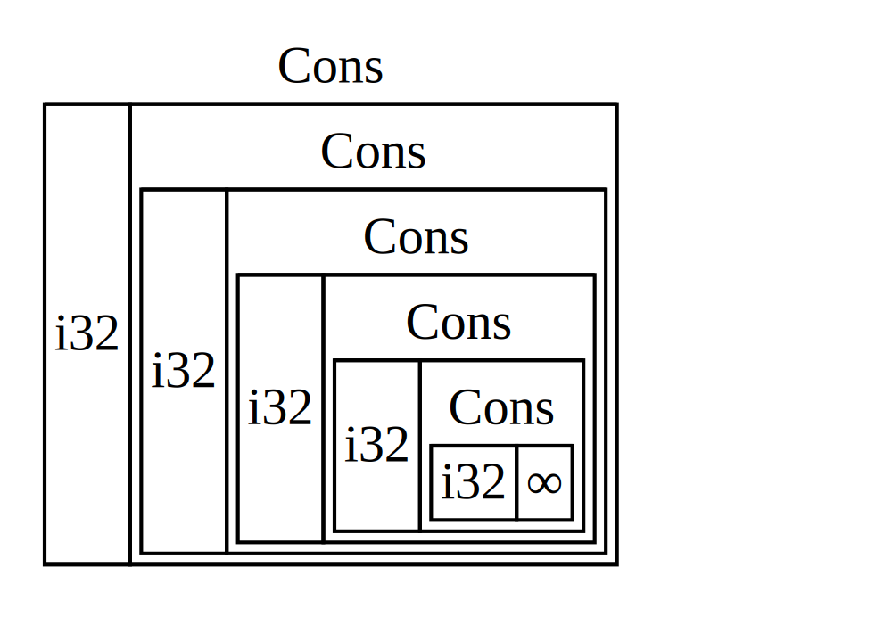
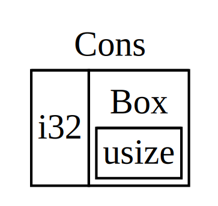

## Usando `Box<T>` para Apuntar a Datos en el Heap

La forma más sencilla de smart pointer es un _box_, cuyo tipo se escribe `Box<T>`.
Los boxes te permiten almacenar datos en el heap en lugar del stack. Lo que
permanece en el stack es el puntero a los datos del heap. Refiérete al Capítulo 4
para revisar la diferencia entre el stack y el heap.

Los boxes no tienen overhead de performance, más allá de almacenar sus datos en
el heap en lugar del stack. Pero tampoco tienen muchas capacidades adicionales.
Los usarás más frecuentemente en estas situaciones:

- Cuando tienes un tipo cuyo tamaño no puede ser conocido en tiempo de
  compilación y quieres usar un valor de ese tipo en un contexto que requiere un
  tamaño exacto
- Cuando tienes una gran cantidad de datos y quieres transferir el ownership,
  pero asegurarte de que los datos no serán copiados cuando hagas eso
- Cuando quieres ser dueño de un valor y solo te importa que sea un tipo que
  implemente un trait en particular, en lugar de ser de un tipo específico

Veremos la primera situación en la sección [“Habilitando Tipos Recursivos con
Boxes”](#habilitando-tipos-recursivos-con-boxes)<!-- ignore -->. En el segundo
caso, transferir el ownership de una gran cantidad de datos puede tomar mucho
tiempo porque los datos son copiados en el stack. Para mejorar el performance en
esta situación, podemos almacenar la gran cantidad de datos en el heap en un
box. Entonces, solo la pequeña cantidad de datos de puntero es copiada en el
stack, mientras que los datos a los que apunta permanecen en un solo lugar en el
heap. El tercer caso es conocido como un _trait object_, y el Capítulo 17 dedica
una sección entera, [“Usando Trait Objects que Permiten Valores de Diferentes
Tipos,”][trait-objects]<!-- ignore --> solo a ese tema. ¡Así que lo que aprendas
aquí lo aplicarás nuevamente en el Capítulo 17!

### Usando un `Box<T>` para Almacenar Datos en el Heap

Antes de discutir el caso de uso de almacenamiento en el heap para la sintaxis de
`Box<T>`, cubriremos la sintaxis y cómo interactuar con valores almacenados
dentro de un `Box<T>`.

El Listado 15-1 muestra cómo usar un box para almacenar un valor `i32` en el
heap:

<span class="filename">Filename: src/main.rs</span>

```rust
{{#rustdoc_include ../listings/ch15-smart-pointers/listing-15-01/src/main.rs}}
```

<span class="caption">Listado 15-1: Almacenando un valor `i32` en el heap usando
un box</span>

Declaramos una variable `b` para tener el valor de un `Box` que apunta al valor
`5`, el cual está almacenado en el heap. Este programa imprimirá `b = 5`; en
este caso, podemos acceder a los datos en el box de forma similar a como lo
haríamos en el stack. Como cualquier valor owned, cuando un box sale del scope,
como `b`hace al final de `main`, será desasignado. La desasignación ocurre tanto
para el box (almacenado en el stack) como para los datos a los que apunta
(almacenados en el heap).

Colocar un solo valor en el heap no es muy útil, así que no usarás boxes por sí
solos de esta forma muy seguido. Tener valores como un solo `i32` en el stack,
donde son almacenados por defecto, es más apropiado en la mayoría de
situaciones. Veamos un caso donde los boxes nos permiten definir tipos que no
podríamos definir si no tuviéramos boxes.

### Habilitando Tipos Recursivos con Boxes

Un valor de _tipo recursivo_ puede tener otro valor del mismo tipo como parte de
sí mismo. Los tipos recursivos plantean un problema porque en tiempo de
compilación Rust necesita saber cuánto espacio ocupa un tipo. Sin embargo, el
anidamiento de valores de tipos recursivos podría teóricamente continuar
infinitamente, así que Rust no puede saber cuánto espacio necesita el valor.
Como los boxes tienen un tamaño conocido, podemos habilitar tipos recursivos
insertando un box en la definición del tipo recursivo.

Como ejemplo de un tipo recursivo, exploremos la _cons list_. Este es un tipo de
dato comúnmente encontrado en lenguajes de programación funcionales. El tipo de
cons list que definiremos es sencillo excepto por la recursión; por lo tanto,
los conceptos en el ejemplo con el que trabajaremos serán útiles en cualquier
situación más compleja que involucre tipos recursivos.

#### Más Información Acerca de la Cons List

Una _cons list_ es una estructura de datos que viene del lenguaje de
programación Lisp y sus dialectos y está compuesta de pares anidados, y es la
versión de Lisp de una lista enlazada. Su nombre viene de la función `cons`
(abreviatura de “construct function” o “función de construcción”) en Lisp que
construye un nuevo par a partir de sus dos argumentos. Al llamar `cons` en un
par que consiste en un valor y otro par, podemos construir cons lists hechas de
pares recursivos.

Por ejemplo, aquí tenemos una representación de pseudocódigo de una cons list
que contiene la lista 1, 2, 3 con cada par en paréntesis:

```text
(1, (2, (3, Nil)))
```

Cada item en una cons list contiene dos elementos: el valor del item actual y el
siguiente item. El último item en la lista contiene solo un valor llamado `Nil`
sin un siguiente item. Una cons list es producida llamando recursivamente la
función `cons`. El nombre canónico para denotar el caso base de la recursión es
`Nil`. Nota que esto no es lo mismo que el concepto de “null” o “nil” en el
Capítulo 6, el cual es un valor inválido o ausente.

La cons list no es un tipo de dato que se use comúnmente en Rust. La mayoría de
las veces cuando tienes una lista de items en Rust, `Vec<T>` es una mejor
opción. Otros tipos de datos recursivos más complejos _son_ útiles en varias
situaciones, pero al comenzar con la cons list en este capítulo, podemos
explorar cómo los boxes nos permiten definir un tipo de dato recursivo sin mucha
distracción.

El Listado 15-2 contiene una definición de enum para una cons list. Nota que
este código no compilará aún porque el tipo `List` no tiene un tamaño conocido,
lo cual demostraremos.

<span class="filename">Filename: src/main.rs</span>

```rust,ignore,does_not_compile
{{#rustdoc_include ../listings/ch15-smart-pointers/listing-15-02/src/main.rs:here}}
```

<span class="caption">Listado 15-2: El primer intento de definir un enum para
representar una estructura de datos de lista de cons con valores `i32`</span>

> Nota: Estamos implementando una const list que solo contiene valores `i32` con
> el propósito de este ejemplo. Podríamos haberla implementado usando genéricos,
> como discutimos en el Capítulo 10, para definir un tipo de cons list que
> pueda almacenar valores de cualquier tipo.

Usando el tipo `List` para almacenar la lista `1, 2, 3` se vería como el código
en el Listado 15-3:

<span class="filename">Filename: src/main.rs</span>

```rust,ignore,does_not_compile
{{#rustdoc_include ../listings/ch15-smart-pointers/listing-15-03/src/main.rs:here}}
```

<span class="caption">Listado 15-3: Usando el enum `List` para almacenar la
lista `1, 2, 3`</span>

El primer valor `Cons` contiene `1` y otro valor `List`. Este valor `List` es
otro valor `Cons` que contiene `2` y otro valor `List`. Este valor `List` es
otro valor `Cons` que contiene `3` y un valor `List`, que es finalmente es
`Nil`, la variante no recursiva que señala el final de la lista.

Si intentamos compilar el código en el Listado 15-3, obtendremos el error que
se muestra en el Listado 15-4:

```console
{{#include ../listings/ch15-smart-pointers/listing-15-03/output.txt}}
```

<span class="caption">Listado 15-4: El error que obtenemos al intentar definir
un enum recursivo</span>

El error muestra que este tipo “tiene un tamaño infinito”. La razón es que
hemos definido `List` con una variante que es recursiva: contiene otro valor de
sí mismo directamente. Como resultado, Rust no puede averiguar cuánto espacio
necesita para almacenar un valor de `List`. Veamos por qué obtenemos este error.
Primero, veremos cómo Rust decide cuánto espacio necesita para almacenar un
valor de un tipo no recursivo.

#### Calculando el Tamaño de un Tipo No Recursivo

Recuerda el enum `Message` que definimos en el Listado 6-2 cuando discutimos
definiciones de enum en el Capítulo 6:

```rust
{{#rustdoc_include ../listings/ch06-enums-and-pattern-matching/listing-06-02/src/main.rs:here}}
```

Para determinar cuánto espacio necesita almacenar un valor de tipo `Message`,
Rust comienza con la variante que necesita la mayor cantidad de espacio. Rust
observa que `Message::Quit` no necesita ningún espacio, `Message::Move` necesita
suficiente espacio para almacenar dos valores `i32` y así sucesivamente. Como
solo una variante será usada, el espacio que un valor de `Message` necesita es
el espacio que necesitaría la variante más grande.

Compara esto con lo que sucede cuando Rust intenta determinar cuánto espacio
necesita un valor de un tipo recursivo como el enum `List` en el Listado 15-2.
El compilador comienza mirando la variante `Cons`, la cual contiene un valor de
tipo `i32` y un valor de tipo `List`. Por lo tanto, `Cons` necesita una cantidad
de espacio igual al tamaño de un `i32` más el tamaño de un `List`. Para
averiguar cuánto espacio necesita el tipo `List`, el compilador mira las
variantes, comenzando con la variante `Cons`. La variante `Cons` contiene un
valor de tipo `i32` y un valor de tipo `List`, y este proceso continúa
infinitamente, como se muestra en la Figura 15-1.



<span class="caption">Figura 15-1: Un `List` infinito consistente en variantes
`Cons` infinitas</span>

#### Usando `Box<T>` para Obtener un Tipo Recursivo con un Tamaño Conocido

Debido a que Rust no puede determinar cuánto espacio necesita asignar para tipos
definidos recursivamente, el compilador muestra un error con una sugerencia
util:

<!-- manual-regeneration
after doing automatic regeneration, look at listings/ch15-smart-pointers/listing-15-03/output.txt and copy the relevant line
-->

```text
help: insert some indirection (e.g., a `Box`, `Rc`, or `&`) to make `List` representable
  |
2 |     Cons(i32, Box<List>),
  |               ++++    +
```

En esta sugerencia, “indirección” significa que en lugar de almacenar un valor
directamente, deberíamos cambiar la estructura de datos para almacenar el valor
indirectamente almacenando un puntero al valor en su lugar.

Debido a que `Box<T>` es un tipo de puntero, Rust siempre sabe cuánto espacio
necesita un `Box<T>`: el tamaño de un puntero no cambia en función de la
cantidad de datos que está almacenando. Esto significa que podemos poner un
`Box<T>` dentro de la variante `Cons` en lugar de otro valor `List` directamente.
El `Box<T>` apuntará al siguiente valor `List` que estará en el heap en lugar de
dentro de la variante `Cons`. Conceptualmente, todavía tenemos una lista,
creada con listas que contienen otras listas, pero esta implementación ahora es
más como colocar los elementos uno al lado del otro en lugar de dentro de uno
del otro.

Podemos cambiar la definición del enum `List` en el Listado 15-2 y el uso de
`List` en el Listado 15-3 al código del Listado 15-5, el cual compilará:

<span class="filename">Nombre de archivo: src/main.rs</span>

```rust
{{#rustdoc_include ../listings/ch15-smart-pointers/listing-15-05/src/main.rs}}
```

<span class="caption">Listado 15-5: Definición de `List` que utiliza `Box<T>`
para tener un tamaño conocido</span>

La variante `Cons` necesita el tamaño de un `i32` más el espacio para almacenar
los datos del puntero. La variante `Nil` no almacena ningún valor, por lo que
necesita menos espacio que la variante `Cons`. Ahora sabemos que cualquier
valor de `List` ocupará el tamaño de un `i32` más el tamaño de los datos del
puntero de un Box. Al usar un Box, hemos roto la cadena infinita y recursiva,
por lo que el compilador puede averiguar el tamaño que necesita para almacenar
un valor de `List`. La Figura 15-2 muestra cómo se ve la variante `Cons` ahora.



<span class="caption">Figura 15-2: Una `List` que no tiene un tamaño infinito
porque `Cons` contiene una `Box`</span>

Los Boxes proporcionan indirección y asignación de heap; no tienen ninguna otra
capacidad especial, como veremos con los otros tipos de smart pointers.
Tampoco tienen la sobrecarga de rendimiento que estas capacidades especiales
incurran, por lo que pueden ser útiles en casos como la lista cons donde la
indirección es la única característica que necesitamos. También veremos más
casos de uso para los boxes en el Capítulo 17.

El tipo `Box<T>` es un tipo de puntero inteligente porque implementa el trait
`Deref`, que permite que los valores de `Box<T>` se traten como referencias
normales. Cuando un `Box<T>` sale del scope, los datos en el heap que apunta se
limpian también porque implementa el trait `Drop`. Estos dos traits serán aún
más importantes para la funcionalidad proporcionada por los otros tipos de
smart pointers que discutiremos en el resto de este capítulo. Exploraremos estos
dos traits en más detalle.

[trait-objects]: ch17-02-trait-objects.html#usando-trait-objects-que-permiten-valores-de-diferentes-tipos
