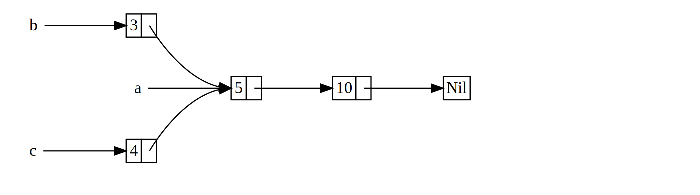

## `Rc<T>`, el Smart Pointer de Conteo de Referencias

En la mayoría de los casos, el ownership es claro: sabes exactamente qué
variable es dueña de un valor dado. Sin embargo, hay casos en los que un solo
valor puede tener múltiples propietarios. Por ejemplo, en estructuras de datos
de gráficos, múltiples aristas pueden apuntar al mismo nodo, y ese nodo es
conceptualmente propiedad de todas las aristas que apuntan a él. Un nodo no
debería ser limpiado a menos que no tenga aristas apuntando a él y, por lo
tanto, no tenga propietarios.

Debes habilitar el ownership múltiple explícitamente usando el tipo de Rust
`Rc<T>`, el cual es una abreviación para _reference counting_. El tipo `Rc<T>`
lleva la cuenta del número de referencias a un valor para determinar si el valor
aún está en uso. Si hay cero referencias a un valor, el valor puede ser limpiado
sin que ninguna referencia se vuelva inválida.

Imagina `Rc<T>` como una TV en una sala familiar. Cuando una persona entra a
ver TV, la enciende. Otros pueden entrar a la sala y ver la TV. Cuando la última
persona sale de la sala, apaga la TV porque ya no está siendo usada. Si alguien
apaga la TV mientras otros aún la están viendo, ¡habría un alboroto de los
televidentes restantes!

Usamos el tipo `Rc<T>` cuando queremos asignar algunos datos en el heap para
que múltiples partes de nuestro programa puedan leer y no podemos determinar en
tiempo de compilación cuál parte terminará usando los datos por último. Si
supiéramos cuál parte terminaría de último, podríamos hacer que esa parte sea
dueña de los datos, y las reglas normales de ownership aplicadas en tiempo de
compilación tomarían efecto.

Nota que `Rc<T>` es solo para uso en escenarios de un solo hilo. Cuando
discutamos concurrencia en el Capítulo 16, cubriremos cómo hacer conteo de
referencias en programas multihilo.

### Usando `Rc<T>` para Compartir Datos

Volvamos a nuestro ejemplo de la lista cons en el Listado 15-5. Recuerda que lo
definimos usando `Box<T>`. Esta vez, crearemos dos listas que comparten
ownership de una tercera lista. Conceptualmente, esto se ve similar a la Figura
15-3.



<span class="caption">Figura 15-3: Dos listas, `b` y `c`, comparten ownership de
una tercera lista, `a`</span>

Crearemos la lista `a` que contiene `5` y luego `10`. Luego haremos dos listas 
más: `b` que comienza con `3` y `c` que comienza con `4`. Ambas listas `b` y `c`
luego continuarán a la primera lista `a` que contiene `5` y `10`. En otras 
palabras, ambas listas compartirán la primera lista que contiene `5` y `10`.

Intentar implementar este escenario usando nuestra definición de `List` con
`Box<T>` no funcionará, como se muestra en el Listado 15-17:

<Listing number="15-17" file-name="src/main.rs" caption="Demostrando que no se nos permite tener dos listas que usen `Box<T>` y traten de compartir ownership de una tercera lista">

```rust,ignore,does_not_compile
{{#rustdoc_include ../listings/ch15-smart-pointers/listing-15-17/src/main.rs}}
```

</Listing>

Cuando intentamos compilar este código, obtenemos este error:

```console
{{#include ../listings/ch15-smart-pointers/listing-15-17/output.txt}}
```

Las variantes `Cons` poseen los datos que contienen, así que cuando creamos la
lista `b`, `a` es movida a `b` y `b` posee `a`. Luego, cuando intentamos usar
`a` nuevamente cuando creamos `c`, no se nos permite porque `a` ha sido movida.

Podríamos cambiar la definición de `Cons` para que contenga referencias en su
lugar, pero entonces tendríamos que especificar parámetros de lifetime. Al
especificar parámetros de lifetime, estaríamos especificando que cada elemento
en la lista vivirá al menos tanto como la lista entera. Este es el caso para
los elementos y listas en el Listado 15-17, pero no en todos los escenarios.

En su lugar, cambiaremos nuestra definición de `List` para usar `Rc<T>` en
lugar de `Box<T>`, como se muestra en el Listado 15-18. Cada variante `Cons`
ahora contendrá un valor y un `Rc<T>` apuntando a una `List`. Cuando creamos
`b`, en lugar de tomar ownership de `a`, clonaremos el `Rc<List>` que `a` está
sosteniendo, aumentando así el número de referencias de uno a dos y permitiendo
que `a` y `b` compartan ownership de los datos en ese `Rc<List>`. También
clonaremos `a` cuando creamos `c`, aumentando el número de referencias de dos a
tres. Cada vez que llamamos a `Rc::clone`, el conteo de referencias a los datos
dentro del `Rc<List>` aumentará, y los datos no serán limpiados a menos que no
haya referencias a él.

<Listing number="15-18" file-name="src/main.rs" caption="Una definición de `List` que utiliza">

```rust
{{#rustdoc_include ../listings/ch15-smart-pointers/listing-15-18/src/main.rs}}
```

</Listing>

Necesitamos agregar una declaración `use` para traer `Rc<T>` al scope porque no
está en el [prelude][prelude]. En `main`, creamos la lista que contiene 5 y 10 y la
almacenamos en un nuevo `Rc<List>` en `a`. Luego cuando creamos `b` y `c`,
llamamos a la función `Rc::clone` y pasamos una referencia al `Rc<List>` en `a`
como argumento.

Podríamos llamar a `Rc::clone()` directamente con `a`, como en `Rc::clone(&a)`.
pero Rust tiene una convención para llamar a `Rc::clone` en este caso. La
implementación de `Rc::clone` no hace una copia profunda de todos los datos
como la mayoría de las implementaciones de `clone` de los tipos hacen. La
llamada a `Rc::clone` solo incrementa el conteo de referencias, lo cual no
toma mucho tiempo. Copias profundas de datos pueden tomar mucho tiempo. Al usar
`Rc::clone` para conteo de referencias, podemos distinguir visualmente entre
las copias profundas y los tipos de clones que incrementan el conteo de
referencias. Cuando busquemos problemas de performance en el código, solo
necesitamos considerar las copias profundas y podemos ignorar las llamadas a
`Rc::clone`.

### Clonando un `Rc<T>` Incrementa el Conteo de Referencias

Vamos a modificar nuestro ejemplo de trabajo en el Listado 15-18 para que
podamos ver los conteos de referencias cambiando a medida que creamos y
descartamos referencias al `Rc<List>` en `a`.

En el Listado 15-19, cambiaremos `main` para que tenga un scope interno alrededor
de la lista `c`; luego podemos ver cómo el conteo de referencias cambia cuando
`c` sale del scope.

<Listing number="15-19" file-name="src/main.rs" caption="Imprimiendo el conteo de referencias">

```rust
{{#rustdoc_include ../listings/ch15-smart-pointers/listing-15-19/src/main.rs:here}}
```

</Listing>

En este punto del programa donde cambia el recuento de referencias, imprimimos
el recuento de referencias utilizando la función `Rc::strong_count`. Esta
función se llama `strong_count` en lugar de `count` porque el tipo `Rc<T>`
también tiene un `weak_count`; veremos para qué se usa `weak_count` en la
sección [“Previniendo Ciclos de Referencias: Usando 
`Weak<T>`”][preventing-ref-cycles]<!-- ignore -->.

Este código imprime lo siguiente:

```console
{{#include ../listings/ch15-smart-pointers/listing-15-19/output.txt}}
```

Podemos ver que el `Rc<List>` en `a` tiene un recuento de referencias de 1;
luego, cada vez que llamamos a `clone` el recuento aumenta en 1. Cuando `c` sale
del scope, el recuento disminuye en 1. No tenemos que llamar a una función para
disminuir el recuento de referencias como tenemos que llamar a `Rc::clone` para
aumentar el recuento de referencias: la implementación del trait `Drop`
disminuye el recuento de referencias automáticamente cuando un valor `Rc<T>`
sale del scope.

Lo que no podemos ver en este ejemplo es que cuando `b` y luego `a` salen del
scope al final de `main`, el recuento es entonces 0, y el `Rc<List>` se limpia
completamente. Usando `Rc<T>` permite que un solo valor tenga múltiples
propietarios, y el recuento asegura que el valor permanezca válido siempre que
cualquiera de los propietarios aún exista.

A través de referencias inmutables, `Rc<T>` permite que comparta datos entre
múltiples partes de su programa para lectura solamente. Si `Rc<T>` le permitiera
tener múltiples referencias mutables también, podría violar una de las reglas
de préstamo discutidas en el Capítulo 4: múltiples préstamos mutables al mismo
lugar pueden causar carreras de datos e inconsistencias. ¡Pero poder mutar datos
es muy útil! En la siguiente sección, discutiremos el patrón de mutabilidad
interior y el tipo `RefCell<T>` que puede usar en conjunto con un `Rc<T>` para
trabajar con esta restricción de inmutabilidad.

[prelude]: ch02-00-guessing-game-tutorial.html#prelude-meaning
[preventing-ref-cycles]: ch15-06-reference-cycles.html#previniendo-ciclos-de-referencia-convirtiendo-un-rct-en-un-weakt
