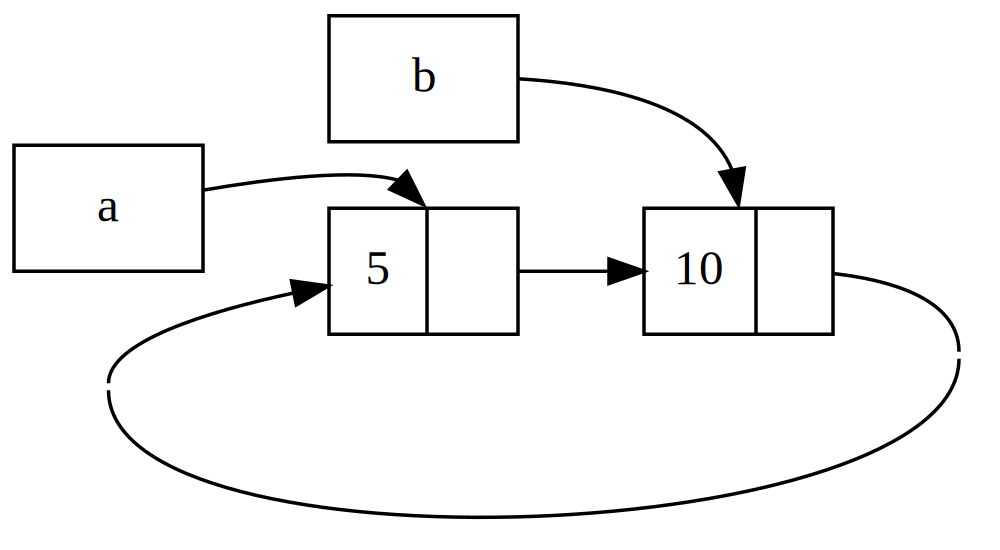

## Referencias Circulares Pueden Fugar Memoria

Las garantías de seguridad de memoria de Rust hacen difícil, pero no imposible,
crear accidentalmente memoria que nunca se limpia (conocido como una *fuga de
memoria*). Prevenir fugas de memoria completamente no es una de las garantías de
Rust, lo que significa que las fugas de memoria son seguras en Rust. Podemos ver
que Rust permite fugas de memoria usando `Rc<T>` y `RefCell<T>`: es posible
crear referencias donde los elementos se refieren entre sí en un ciclo. Esto
crea fugas de memoria porque el recuento de referencias de cada elemento en el
ciclo nunca alcanzará 0, y los valores nunca serán descartados.

### Creando una Referencia Circular

Vamos a ver cómo podría ocurrir una referencia circular y cómo prevenirla, 
comenzando con la definición del enum `List` y un método `tail` en el Listado
15-25:

<span class="filename">Filename: src/main.rs</span>

```rust
{{#rustdoc_include ../listings/ch15-smart-pointers/listing-15-25/src/main.rs}}
```

<span class="caption">Listing 15-25: Una definición de lista de desventajas 
(cons) que  contiene un `RefCell<T>` para poder modificar a que se refiere una
variante `Cons`</span>

Estamos usando otra variación de la definición de `List` del Listado 15-5. El
segundo elemento en la variante `Cons` es ahora `RefCell<Rc<List>>`, lo que
significa que en lugar de tener la capacidad de modificar el valor `i32` como lo
hicimos en el Listado 15-24, queremos modificar el valor `List` al que una
variante `Cons` está apuntando. También estamos agregando un método `tail` para
que sea conveniente para nosotros acceder al segundo elemento si tenemos una
variante `Cons`.

En el Listado 15-26, estamos agregando una función `main` que usa las
definiciones en el Listado 15-25. Este código crea una lista en `a` y una lista
en `b` que apunta a la lista en `a`. Luego modifica la lista en `a` para que
apunte a `b`, creando un ciclo de referencia. Hay declaraciones `println!` a lo
largo del camino para mostrar cuáles son los recuentos de referencia en varios
puntos de este proceso.

<span class="filename">Filename: src/main.rs</span>

```rust
{{#rustdoc_include ../listings/ch15-smart-pointers/listing-15-26/src/main.rs:here}}
```

<span class="caption">Listing 15-26: Creando un ciclo de referencia de dos 
valores `List` que se apuntan mutuamente.</span>

Creamos una instancia `Rc<List>` que contiene un valor `List` en la variable
`a` con una lista inicial de `5, Nil`. Luego creamos una instancia `Rc<List>`
que contiene otro valor `List` en la variable `b` que contiene el valor 10 y
apunta a la lista en `a`.

Modificamos `a` para que apunte a `b` en lugar de `Nil`, creando un ciclo. 
Hacemos eso usando el método `tail` para obtener una referencia al 
`RefCell<Rc<List>>` en `a`, que ponemos en la variable `link`. Luego usamos el 
método `borrow_mut` en el `RefCell<Rc<List>>` para cambiar el valor interno de 
un `Rc<List>` que contiene un valor `Nil` al `Rc<List>` en `b`.

Cuando ejecutamos este código, manteniendo el último `println!` comentado por
el momento, obtendremos este output:

```console
{{#include ../listings/ch15-smart-pointers/listing-15-26/output.txt}}
```

El recuento de referencia de las instancias `Rc<List>` en `a` y `b` son 2
después de cambiar la lista en `a` para que apunte a `b`. Al final de `main`,
Rust descarta la variable `b`, que disminuye el recuento de referencia de la
instancia `Rc<List>` de `b` de 2 a 1. La memoria que `Rc<List>` tiene en el
heap no se descartará en este punto, porque su recuento de referencia es 1, 
no 0. Luego Rust descarta `a`, que disminuye el recuento de referencia de la
instancia `Rc<List>` de `a` de 2 a 1 también. La memoria asignada a la lista
no se recogerá nunca. Para visualizar este ciclo de referencia, hemos creado
un diagrama en la Figura 15-4.



<span class="caption">Figure 15-4: Un ciclo de referencia de las listas `a` 
y `b` apuntándose mutuamente.</span>

Si descomentas el último `println!` y ejecutas el programa, Rust intentará
imprimir este ciclo con `a` apuntando a `b` apuntando a `a` y así sucesivamente
hasta que desborda el stack.

En comparación con un programa del mundo real, las consecuencias de crear un
ciclo de referencia en este ejemplo no son muy graves: justo después de crear
el ciclo de referencia, el programa termina. Sin embargo, si un programa más
complejo asignara mucha memoria en un ciclo y la mantuviera durante mucho
tiempo, el programa usaría más memoria de la que necesitaba y podría
abrumar el sistema, causando que se quede sin memoria disponible.

Crear ciclos de referencia no es algo fácil de hacer, pero tampoco es imposible.
Si tienes valores `RefCell<T>` que contienen valores `Rc<T>` o combinaciones
similares de tipos con mutabilidad interior y recuento de referencias anidados,
debes asegurarte de no crear ciclos; no puedes confiar en Rust para atraparlos.
Crear un ciclo de referencia sería un error de lógica en tu programa que 
deberías usar pruebas automatizadas, revisiones de código y otras prácticas de 
desarrollo de software para minimizar.

Otra solución para evitar ciclos de referencia es reorganizar tus estructuras
de datos para que algunas referencias expresen propiedad y algunas referencias
no expresen ownership. Como resultado, puedes tener ciclos compuestos por
algunas relaciones de ownership y algunas relaciones de no ownership, y solo
las relaciones de ownership afectan si un valor puede ser descartado. En el
Listado 15-25, siempre queremos que las variantes `Cons` posean su lista, por
lo que no es posible reorganizar la estructura de datos. Veamos un ejemplo
usando gráficos compuestos por nodos padres y nodos hijos para ver cuándo las
relaciones de no ownership son una forma apropiada de evitar ciclos de
referencia.

### Previniendo ciclos de referencia: convirtiendo un `Rc<T>` en un `Weak<T>`

Hasta ahora, hemos demostrado que llamar a `Rc::clone` aumenta el `strong_count`
de una instancia `Rc<T>`, y una instancia `Rc<T>` solo se limpia si su
`strong_count` es 0. También puedes crear una *referencia débil* al valor
dentro de una instancia `Rc<T>` llamando a `Rc::downgrade` y pasando una
referencia a la `Rc<T>`. Las referencias fuertes son cómo puedes compartir el
ownership de una instancia `Rc<T>`. Las referencias débiles no expresan una
relación de ownership, y su recuento no afecta cuándo se limpia una instancia
`Rc<T>`. No causarán un ciclo de referencia porque cualquier ciclo que involucre
algunas referencias débiles se romperá una vez que el recuento de referencias
fuertes de los valores involucrados sea 0.

Cuando llamas a `Rc::downgrade`, obtienes un smart pointer de tipo `Weak<T>`. 
En lugar de aumentar el `strong_count` en la instancia de `Rc<T>` en 1, llamar a 
`Rc::downgrade` aumenta el `weak_count` en 1. El tipo `Rc<T>` utiliza el 
`weak_count` para realizar un seguimiento de cuántas referencias `Weak<T>` 
existen, de manera similar al `strong_count`. La diferencia es que el 
`weak_count` no necesita ser 0 para que se limpie la instancia de `Rc<T>`.

Dado que el valor al que apunta `Weak<T>` puede haber sido eliminado, para
hacer cualquier cosa con el valor al que apunta un `Weak<T>`, debes asegurarte
de que el valor aún exista. Haz esto llamando al método `upgrade` en una
instancia `Weak<T>`, que devolverá un `Option<Rc<T>>`. Si el valor `Rc<T>` aún
no se ha eliminado, `upgrade` devolverá `Some`, y si el valor `Rc<T>` se ha
eliminado, `upgrade` devolverá `None`. Porque `upgrade` devuelve un
`Option<Rc<T>>`, Rust se asegurará de que se manejen los casos `Some` y `None`,
y no habrá un puntero no válido.

Como ejemplo, en lugar de usar una lista cuyos elementos solo conocen al
siguiente elemento, crearemos un árbol cuyos elementos conocen a sus elementos
hijos *y* a sus elementos padres.

#### Creando una estructura de datos de árbol: un `Node` con nodos hijos

Para comenzar, construiremos un árbol con nodos que conocen a sus nodos hijos.
Crearemos una estructura llamada `Node` que contenga su propio valor `i32` así
como referencias a sus nodos hijos `Node`:

<span class="filename">Filename: src/main.rs</span>

```rust
{{#rustdoc_include ../listings/ch15-smart-pointers/listing-15-27/src/main.rs:here}}
```

Queremos que un `Node` sea propietario de sus hijos, y queremos compartir
ese ownership con variables para que podamos acceder a cada `Node` en el árbol
directamente. Para hacer esto, definimos los elementos `Vec<T>` para ser
valores de tipo `Rc<Node>`. También queremos modificar qué nodos son hijos de
otro nodo, por lo que tenemos un `RefCell<T>` en `children` alrededor del
`Vec<Rc<Node>>`.

A continuación, usaremos la definición de nuestro struct y crearemos una
instancia `Node` llamada `leaf` con el valor 3 y sin hijos, y otra instancia
llamada `branch` con el valor 5 y `leaf` como uno de sus hijos, como se muestra
en el Listado 15-26:

<span class="filename">Filename: src/main.rs</span>

```rust
{{#rustdoc_include ../listings/ch15-smart-pointers/listing-15-27/src/main.rs:there}}
```

<span class="caption">Listing 15-27: Creando un nodo `leaf` sin hijos y un nodo
`branch` con `leaf` como uno de sus hijos</span>

Clonamos el `Rc<Node>` en `leaf` y lo almacenamos en `branch`, lo que significa
que el `Node` en `leaf` ahora tiene dos propietarios: `leaf` y `branch`. Podemos
ir de `branch` a `leaf` a través de `branch.children`, pero no hay forma de
ir de `leaf` a `branch`. La razón es que `leaf` no tiene referencia a `branch`
y no sabe que están relacionados. Queremos que `leaf` sepa que `branch` es su
padre. Lo haremos a continuación.

#### Agregando una referencia de un hijo a su padre

Para hacer que el nodo hijo sea consciente de su padre, necesitamos agregar un
campo `parent` a nuestra definición de struct `Node`. El problema está en
decidir qué tipo de `parent` debería ser. Sabemos que no puede contener un
`Rc<T>`, porque eso crearía un ciclo de referencia con `leaf.parent` apuntando
a `branch` y `branch.children` apuntando a `leaf`, lo que haría que sus valores
`strong_count` nunca fueran 0.

Si pensamos en las relaciones de otra manera, un nodo padre debería ser
propietario de sus nodos hijos: si se elimina un nodo padre, sus nodos hijos
también deberían eliminarse. Sin embargo, un hijo no debería ser propietario de
su padre: si eliminamos un nodo hijo, el padre aún debería existir. ¡Este es un
caso para las referencias débiles!

Entonces en lugar de `Rc<T>`, usaremos `Weak<T>` como tipo de dato para `parent`
, específicamente `RefCell<Weak<Node>>`. Ahora nuestra definición de struct
`Node` se ve así:

<span class="filename">Filename: src/main.rs</span>

```rust
{{#rustdoc_include ../listings/ch15-smart-pointers/listing-15-28/src/main.rs:here}}
```

Un nodo podrá referirse a su nodo padre, pero no será propietario de él. En
el Listado 15-28, actualizamos `main` para usar esta nueva definición, por lo
que el nodo `leaf` tendrá una forma de referirse a su nodo padre, `branch`:

<span class="filename">Filename: src/main.rs</span>

```rust
{{#rustdoc_include ../listings/ch15-smart-pointers/listing-15-28/src/main.rs:there}}
```

<span class="caption">Listing 15-28: Un nodo `leaf` con una referencia débil a 
su nodo padre `branch`</span>

La creación del nodo `leaf` se ve similar al Listado 15-27 con la excepción del
campo `parent`: `leaf` comienza sin un padre, por lo que creamos una nueva
instancia de referencia `Weak<Node>` vacía.

En este punto, cuando intentamos obtener una referencia al padre de `leaf`
usando el método `upgrade`, obtenemos un valor `None`. Vemos esto en el output
de la primera instrucción `println!`:

```text
leaf parent = None
```

Cuando creamos el nodo `branch`, también tendrá una nueva referencia 
`Weak<Node>` en el campo `parent`, porque `branch` no tiene un nodo padre.
Todavía tenemos `leaf` como uno de los hijos de `branch`. Una vez que tenemos
la instancia `Node` en `branch`, podemos modificar `leaf` para darle una
referencia `Weak<Node>` a su padre. Usamos el método `borrow_mut` en el
`RefCell<Weak<Node>>` en el campo `parent` de `leaf`, y luego usamos la
función `Rc::downgrade` para crear una referencia `Weak<Node>` a `branch` desde
el `Rc<Node>` en `branch`.

Cuando imprimimos el padre de `leaf` nuevamente, esta vez obtendremos una
variante `Some` que contiene `branch`: ¡ahora `leaf` puede acceder a su padre!
Cuando imprimimos `leaf`, también evitamos el ciclo que eventualmente terminó
en un desbordamiento de pila como teníamos en el Listado 15-26; las referencias
`Weak<Node>` se imprimen como `(Weak)`:

```text
leaf parent = Some(Node { value: 5, parent: RefCell { value: (Weak) },
children: RefCell { value: [Node { value: 3, parent: RefCell { value: (Weak) },
children: RefCell { value: [] } }] } })
```

La falta de output infinito indica que este código no creó un ciclo de
referencia. También podemos decir esto mirando los valores que obtenemos al
llamar a `Rc::strong_count` y `Rc::weak_count`.

#### Visualizando cambios en `strong_count` y `weak_count`

Veamos cómo cambian los valores `strong_count` y `weak_count` de las instancias
`Rc<Node>` al crear y modificar `branch`. El Listado 15-29 muestra el código
que usamos para crear `branch` en un nuevo scope interno y examinar los valores
de referencia `strong_count` y `weak_count`. Al hacerlo, podemos ver qué
sucede cuando se crea `branch` y luego se elimina cuando sale del scope. Las
modificaciones se muestran en el Listado 15-29:

<span class="filename">Filename: src/main.rs</span>

```rust
{{#rustdoc_include ../listings/ch15-smart-pointers/listing-15-29/src/main.rs:here}}
```

<span class="caption">Listing 15-29: Creando `branch` en un scope interno y
examinando los recuentos de referencias fuertes y débiles</span>

Después de crear `leaf`, el `Rc<Node>` tiene un `strong_count` de 1 y un
`weak_count` de 0. En el scope interno, creamos `branch` y lo asociamos con
`leaf`, momento en el que cuando imprimimos los conteos, el `Rc<Node>` en
`branch` tendrá un `strong_count` de 1 y un `weak_count` de 1 (porque
`leaf.parent` apunta a `branch` con un `Weak<Node>`). Cuando imprimimos los
conteos en `leaf`, veremos que tendrá un `strong_count` de 2, porque `branch`
ahora tiene un clon del `Rc<Node>` de `leaf` almacenado en `branch.children`,
pero aún tendrá un `weak_count` de 0.

Cuando el scope interno termina, `branch` sale del scope y el recuento fuerte
del `Rc<Node>` en `branch` se reduce a 0, por lo que su `Node` se elimina. El
recuento débil de 1 de `leaf.parent` no tiene ninguna consecuencia sobre si se
elimina o no `Node`, ¡así que no obtenemos fugas de memoria!

Si intentamos acceder al padre de `leaf` después del final del scope, 
obtendremos `None` nuevamente. Al final del programa, el `Rc<Node>` en `leaf`
tiene un recuento fuerte de 1 y un recuento débil de 0, porque la variable
`leaf` es nuevamente la única referencia al `Rc<Node>`.

Toda la lógica que gestiona los recuentos y la eliminación de valores está
incorporada en `Rc<T>` y `Weak<T>` y sus implementaciones del trait `Drop`. Al
especificar que la relación de un hijo con su padre debe ser una referencia
`Weak<T>` en la definición de `Node`, puede tener nodos padres que apunten a
nodos hijos y viceversa sin crear un ciclo de referencia y fugas de memoria.

## Resumen

Este capítulo cubrió cómo usar smart pointers para hacer diferentes garantías y
compensaciones de las que Rust hace de forma predeterminada con referencias
regulares. El tipo `Box<T>` tiene un tamaño conocido y apunta a datos
asignados en el heap. El tipo `Rc<T>` realiza un seguimiento del número de
referencias a los datos en el heap para que los datos puedan tener múltiples
propietarios. El tipo `RefCell<T>` con su mutabilidad interior nos da un tipo
que podemos usar cuando necesitamos un tipo inmutable, pero necesitamos cambiar
un valor interno de ese tipo; también hace cumplir las reglas de borrowing en
tiempo de ejecución en lugar de en tiempo de compilación.

También se discutieron los traits `Deref`, `Drop`,que habilitan gran parte
de la funcionalidad de los smart pointers. Exploramos los ciclos de referencia
que pueden causar fugas de memoria y cómo prevenirlos usando `Weak<T>`.

Si este capítulo ha despertado tu interés y quieres implementar tus propios
smart pointers, consulta [“The Rustonomicon”][nomicon] para obtener más
información útil.

A continuación, hablaremos sobre la concurrencia en Rust. Incluso aprenderás
sobre algunos nuevos smart pointers.

[nomicon]: ../nomicon/index.html
