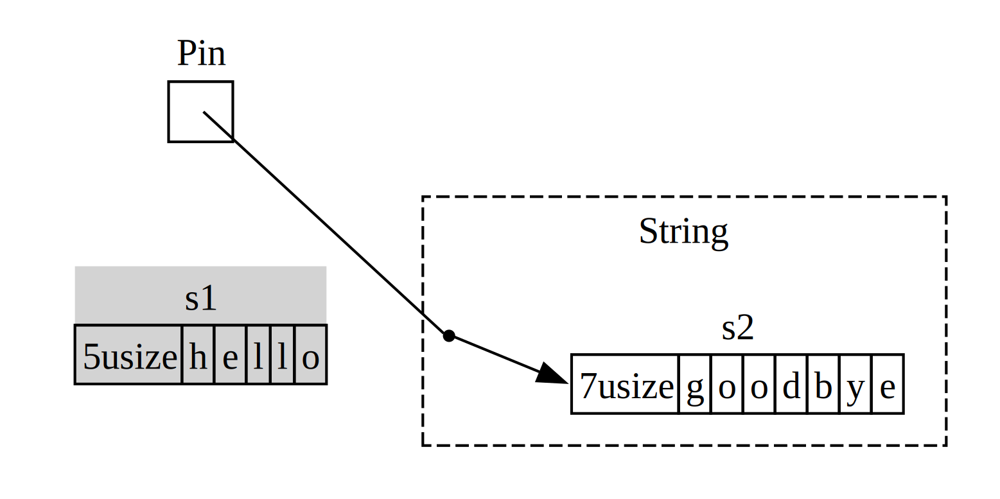

## Profundizando en los rasgos para async

<!-- Old headings. Do not remove or links may break. -->

<a id="digging-into-the-traits-for-async"></a>

A lo largo del capítulo, hemos utilizado los traits `Future`, `Pin`, `Unpin`,
`Stream` y `StreamExt` de diversas maneras. Hasta ahora, sin embargo, hemos
evitado profundizar demasiado en los detalles de cómo funcionan o cómo se
relacionan. La mayor parte del tiempo al escribir Rust día a día, esto está 
bien. A veces, sin embargo, te encontrarás en situaciones en las que entender
algunos de estos detalles adicionales importa. En esta sección, profundizaremos
*lo suficiente* para ayudar con esas situaciones, ¡pero dejando la inmersión
*realmente* profunda para otra documentación!

### Futuro

En [Futuros y la sintaxis async][futures-syntax], mencionamos que `Future` es un
trait. Comencemos por echar un vistazo más de cerca a cómo funciona. Así es como
Rust define un `Future`:

```rust
use std::pin::Pin;
use std::task::{Context, Poll};

pub trait Future {
    type Output;

    fn poll(self: Pin<&mut Self>, cx: &mut Context<'_>) -> Poll<Self::Output>;
}
```

La definición de este trait incluye un montón de nuevos tipos y también algo de
sintaxis que no hemos visto antes, así que vamos a recorrer la definición pieza
por pieza.

Primero, el tipo asociado `Output` de `Future` indica a qué se resuelve el
futuro. Esto es análogo al tipo asociado `Item` del trait `Iterator`. En segundo
lugar, `Future` también tiene el método `poll`, que toma una referencia especial
de `Pin` para su parámetro `self` y una referencia mutable a un tipo `Context`,
y devuelve un `Poll<Self::Output>`. Hablaremos un poco más sobre `Pin` y
`Context` más adelante en la sección. Por ahora, centrémonos en lo que devuelve
el método, el tipo `Poll`:

```rust
enum Poll<T> {
    Ready(T),
    Pending,
}
```

Este tipo `Poll` es similar a un `Option`: tiene una variante que tiene un valor
(`Ready(T)`) y una que no lo tiene (`Pending`). ¡Sin embargo, significa algo
bastante diferente! La variante `Pending` indica que el futuro todavía tiene
trabajo por hacer, por lo que el llamante deberá volver a comprobar más tarde.
La variante `Ready` indica que el `Future` ha terminado su trabajo y el valor
`T` está disponible.

> Nota: Con la mayoría de los futuros, el llamante no debería llamar a `poll`
> nuevamente después de que el futuro haya devuelto `Ready`. ¡Muchos futuros
> generarán un pánico si se vuelven a llamar después de estar listos! Los 
futuros que son seguros de volver a llamar dirán explícitamente en su
documentación. ¡Esto es similar a cómo se comporta `Iterator::next`!

Bajo el capó, cuando ves código que usa `await`, Rust lo compila a código que
llama a `poll`. Si vuelves a mirar el Listado 17-4, donde imprimimos el título
de la página para una sola URL una vez que se resolvió, Rust lo compila en algo
así (aunque no exactamente):

```rust,ignore
match page_title(url).poll() {
    Ready(page_title) => match page_title {
        Some(title) => println!("The title for {url} was {title}"),
        None => println!("{url} had no title"),
    }
    Pending => {
        // ¿Pero qué va aquí?
    }
}
```

¿Qué deberíamos hacer cuando el `Future` todavía está `Pending`? Necesitamos
alguna forma de intentarlo nuevamente... y nuevamente, y nuevamente, hasta que
finalmente el futuro esté listo. En otras palabras, un bucle:

```rust,ignore
let mut page_title_fut = page_title(url);
loop {
    match page_title_fut.poll() {
        Ready(value) => match page_title {
            Some(title) => println!("The title for {url} was {title}"),
            None => println!("{url} had no title"),
        }
        Pending => {
            // continuar
        }
    }
}
```

Sin embargo, si Rust lo compilara exactamente a ese código, cada `await` sería
bloqueante, ¡exactamente lo contrario de lo que estábamos buscando! En cambio,
Rust se asegura de que el bucle pueda ceder el control a algo que pueda pausar
el trabajo en este futuro y trabajar en otros futuros y volver a comprobar este
más tarde. Ese “algo” es un tiempo de ejecución async, y esta programación y
coordinación es uno de los trabajos principales de un tiempo de ejecución.

Recuerda nuestra descripción (en la sección [Contando][counting]) de esperar en
`rx.recv`. La llamada `recv` devuelve un `Future`, y esperarlo lo encuesta. En
nuestra discusión inicial, notamos que un tiempo de ejecución pausará el futuro
hasta que esté listo con `Some(message)` o `None` cuando el canal se cierre. Con
nuestro entendimiento más profundo de `Future` en su lugar, y específicamente
`Future::poll`, podemos ver cómo funciona. El tiempo de ejecución sabe que el
futuro no está listo cuando devuelve `Poll::Pending`. Por el contrario, el
tiempo de ejecución sabe que el futuro está listo y lo avanza cuando `poll`
devuelve `Poll::Ready(Some(message))` o `Poll::Ready(None)`.

Los detalles exactos de cómo un tiempo de ejecución hace eso son más de lo que
cubriremos incluso en esta sección de inmersión profunda. La clave aquí es ver
el mecanismo básico de los futuros: un tiempo de ejecución *encuesta* cada 
futuro del que es responsable, poniéndolo a dormir cuando aún no está listo.

<!-- Old headings. Do not remove or links may break. -->

<a id="pinning-and-the-pin-and-unpin-traits"></a>

### Pinning y los traits Pin y Unpin

Cuando introdujimos la idea de pinning mientras trabajábamos en el Listado 
17-16, nos encontramos con un mensaje de error muy complicado. Aquí está la
parte relevante de nuevo:

<!-- manual-regeneration
cd listings/ch17-async-await/listing-17-16
cargo build
copy *only* the final `error` block from the errors
-->

```text
error[E0277]: `{async block@src/main.rs:10:23: 10:33}` cannot be unpinned
  --> src/main.rs:48:33
   |
48 |         trpl::join_all(futures).await;
   |                                 ^^^^^ the trait `Unpin` is not implemented for `{async block@src/main.rs:10:23: 10:33}`, which is required by `Box<{async block@src/main.rs:10:23: 10:33}>: Future`
   |
   = note: consider using the `pin!` macro
           consider using `Box::pin` if you need to access the pinned value outside of the current scope
   = note: required for `Box<{async block@src/main.rs:10:23: 10:33}>` to implement `Future`
note: required by a bound in `futures_util::future::join_all::JoinAll`
  --> file:///home/.cargo/registry/src/index.crates.io-6f17d22bba15001f/futures-util-0.3.30/src/future/join_all.rs:29:8
   |
27 | pub struct JoinAll<F>
   |            ------- required by a bound in this struct
28 | where
29 |     F: Future,
   |        ^^^^^^ required by this bound in `JoinAll`
```

Cuando leemos este mensaje de error con atención, no solo nos indica que 
necesitamos "pinear" (fijar/pin) los valores, sino que también nos explica por 
qué es necesario "pinearlos". La función trpl::join_all devuelve una estructura 
llamada JoinAll. Esa estructura es genérica sobre un tipo F, el cual está 
restringido a implementar el trait Future. Al esperar directamente un futuro con 
await, el futuro se "pinea" implícitamente. Por eso no necesitamos usar pin! en 
todos los lugares donde queremos esperar futuros

Sin embargo, aquí no estamos esperando directamente un futuro. En su lugar,
construimos un nuevo futuro, `JoinAll`, pasando una colección de futuros a la
función `join_all`. La firma de `join_all` requiere que el tipo de los elementos
de la colección implementen el trait `Future`, y `Box<T>` solo implementa
`Future` si `T` que envuelve es un futuro que implementa el trait `Unpin`.

¡Eso es mucho! Pero podemos entenderlo, si profundizamos un poco más en cómo
funciona el tipo `Future`, en particular en torno al *pineado*.

Veamos nuevamente la definición de `Future`:

```rust
use std::pin::Pin;
use std::task::{Context, Poll};

pub trait Future {
    type Output;

    // Required method
    // Método requerido
    fn poll(self: Pin<&mut Self>, cx: &mut Context<'_>) -> Poll<Self::Output>;
}
```

El parámetro `cx` y su tipo `Context` son la clave de cómo un tiempo de 
ejecución realmente sabe cuándo comprobar cualquier futuro dado, mientras sigue
siendo perezoso. Sin embargo, los detalles de cómo funciona eso están más allá
del alcance de este capítulo: generalmente solo necesitas preocuparte por ello
cuando escribes una implementación personalizada de `Future`.

En cambio, nos centraremos en el tipo para `self`. Esta es la primera vez que
vemos un método donde `self` tiene una anotación de tipo. Una anotación de tipo
para `self` es similar a las anotaciones de tipo para otros parámetros de
función, con dos diferencias clave. Primero, cuando especificamos el tipo de
`self` de esta manera, le estamos diciendo a Rust qué tipo debe ser `self` para
llamar a este método. En segundo lugar, una anotación de tipo en `self` no puede
ser solo cualquier tipo. Solo se permite que sea el tipo en el que se implementa
el método, una referencia o un puntero inteligente a ese tipo, o un `Pin` que
envuelve una referencia a ese tipo. Veremos más sobre esta sintaxis en el
[Capítulo 18][ch-18]<!-- ignore -->. Por ahora, es suficiente saber que si 
queremos encuestar un futuro (para comprobar si está `Pending` o 
`Ready(Output)`), necesitamos una referencia mutable al tipo, que está envuelto 
en un `Pin`.

`Pin` es un tipo de envoltura (wrapper type). En ciertos aspectos, es similar a
`Box`, `Rc` y otros tipos de punteros inteligentes que vimos en el Capítulo 15,
que también envuelven otros tipos. Sin embargo, a diferencia de esos, `Pin` solo
funciona con *tipos de puntero* como referencias (`&` y `&mut`) y punteros
inteligentes (`Box`, `Rc`, y así sucesivamente). Para ser precisos, `Pin`
funciona con tipos que implementan los traits `Deref` o `DerefMut`, que cubrimos
en el Capítulo 15. Puedes pensar en esta restricción como equivalente a solo
trabajar con punteros, porque implementar `Deref` o `DerefMut` significa que tu
tipo se comporta de manera similar a un tipo de puntero. `Pin` tampoco es un
puntero en sí mismo, y no tiene ningún comportamiento propio como lo hacen `Rc`
y `Arc` con el conteo de referencias. Es puramente una herramienta que el
compilador puede usar para mantener las garantías relevantes, envolviendo
punteros en el tipo.

Recordando que `await` se implementa en términos de llamadas a `poll`, esto
comienza a explicar el mensaje de error que vimos anteriormente, pero eso fue en
términos de `Unpin`, no de `Pin`. Entonces, ¿qué son exactamente `Pin` y `Unpin`,
cómo se relacionan y por qué `Future` necesita que `self` esté en un tipo `Pin`
para llamar a `poll`?

En [Nuestro primer programa async][first-async], describimos cómo una serie de
awaits en un futuro se compilan en una máquina de estados, y señalamos
cómo el compilador ayuda a asegurarse de que esa máquina de estados siga todas
las reglas normales de Rust en torno a la seguridad, incluyendo el préstamo y la
propiedad. Para que eso funcione, Rust mira qué datos se necesitan entre cada
punto de espera y el siguiente punto de espera o el final del bloque async. 
Luego crea una variante correspondiente en la máquina de estados que crea. Cada
variante obtiene el acceso que necesita a los datos que se utilizarán en esa
sección del código fuente, ya sea tomando posesión de esos datos o obteniendo
una referencia mutable o inmutable a ellos.

Hasta aquí todo bien: si nos equivocamos sobre el ownership o las referencias en
un bloque async dado, el verificador de préstamos nos lo dirá. Cuando queremos
mover el futuro que corresponde a ese bloque, como moverlo a un `Vec` para pasar
a `join_all`, de la forma en que lo hicimos en la sección [“Trabajando con
cualquier cantidad de futuros”][any-number-futures]<!-- ignore -->, las cosas se
ponen más complicadas.

Cuando movemos un futuro, ya sea empujándolo en una estructura de datos para
usarlo como un iterador con `join_all`, o devolviéndolos desde una función, eso
significa mover la máquina de estados que Rust crea para nosotros. Y a diferencia
de la mayoría de los otros tipos en Rust, los futuros que Rust crea para bloques
async pueden terminar con referencias a sí mismos en los campos de cualquier
variante dada, como en la Figura 17-4 (una ilustración simplificada para 
ayudarte a tener una idea de la idea, en lugar de profundizar en lo que a menudo 
son detalles bastante complicados).

<figure>


<figcaption>Figura 17-4: Un tipo de datos auto-referencial.</figcaption>

</figure>

Sin embargo, por defecto, cualquier objeto que tenga una referencia a sí mismo
es inseguro de mover, porque las referencias siempre apuntan a la dirección de
memoria real de la cosa a la que se refieren. Si mueves la estructura de datos
en sí, esas referencias internas seguirán apuntando a la ubicación antigua.
Sin embargo, esa ubicación de memoria ahora es inválida. Por un lado, su valor
no se actualizará cuando hagas cambios en la estructura de datos. Por otro lado,
¡y más importante! ¡la computadora ahora es libre de reutilizar esa memoria para
otras cosas! Podrías terminar leyendo datos completamente no relacionados más
tarde.

<figure>


<figcaption>Figura 17-5: El resultado inseguro de mover un tipo de datos auto-referencial.</figcaption>

</figure>

En principio, el compilador de Rust podría intentar actualizar cada referencia a
un objeto cada vez que se mueve. Eso podría ser un sobrecoste de rendimiento
potencialmente grande, especialmente dado que puede haber una red completa de
referencias que necesitan actualizarse. Por otro lado, si pudiéramos asegurarnos
de que la estructura de datos en cuestión *no se mueva en memoria*, no tenemos
que actualizar ninguna referencia. Esto es exactamente lo que requiere el
verificador de préstamos de Rust: no puedes mover un elemento que tenga alguna
referencia activa a él usando código seguro.

`Pin` se basa en eso para darnos la garantía exacta que necesitamos. Cuando
*pineamos* un valor envolviendo un puntero a ese valor en `Pin`, ya no se puede
mover. Por lo tanto, si tienes `Pin<Box<SomeType>>`, en realidad estás pineando
el valor `SomeType`, *no* el puntero `Box`. La Figura 17-6 ilustra esto:

<figure>


<figcaption>Figura 17-6: Pineando un `Box` que apunta a un tipo de futuro auto-referencial.</figcaption>

</figure>

De hecho, el puntero `Box` todavía puede moverse libremente. Recuerda: nos
importa asegurarnos de que los datos a los que se hace referencia en última
instancia permanezcan en su lugar. Si un puntero se mueve, pero los datos a los
que apunta están en el mismo lugar, como en la Figura 17-7, no hay ningún
problema potencial. (Cómo harías esto con un `Pin` envolviendo un `Box` es más
de lo que profundizaremos en esta discusión en particular, ¡pero sería un buen
ejercicio! Si miras la documentación de los tipos, así como el módulo 
`std::pin`, podrías averiguar cómo lo harías). La clave es que el tipo
auto-referencial en sí no puede moverse, porque todavía está pineado.

<figure>


<figcaption>Figura 17-7: Moviendo un `Box` que apunta a un tipo de futuro auto-referencial.</figcaption>

</figure>

Sin embargo, la mayoría de los tipos son perfectamente seguros de mover, incluso
si resulta que están detrás de un puntero `Pin`. Solo necesitamos pensar en
pinear cuando los elementos tienen referencias internas. Valores primitivos como
números y booleanos no tienen referencias internas, por lo que obviamente son
seguros. Tampoco la mayoría de los tipos con los que normalmente trabajas en
Rust. Un `Vec`, por ejemplo, no tiene referencias internas que necesite mantener
actualizadas de esta manera, por lo que puedes moverlo sin preocuparte. Si 
tienes un `Pin<Vec<String>>`, tendrías que hacer todo a través de las API
seguras pero restrictivas proporcionadas por `Pin`, aunque un `Vec<String>`
siempre es seguro de mover si no hay otras referencias a él. Necesitamos una
forma de decirle al compilador que en realidad está bien mover elementos en
casos como estos. Para eso, tenemos `Unpin`.

`Unpin` es un trait marcador, similar a los traits `Send` y `Sync` que vimos en
el Capítulo 16. Recuerda que los traits marcadores no tienen funcionalidad
propia. Solo existen para decirle al compilador que es seguro usar el tipo que
implementa un trait dado en un contexto particular. `Unpin` informa al
compilador que un tipo dado *no* necesita mantener ninguna garantía particular
sobre si el valor en cuestión puede moverse.

Al igual que con `Send` y `Sync`, el compilador implementa `Unpin`
automáticamente para todos los tipos donde puede demostrar que es seguro. El
caso especial, nuevamente similar a `Send` y `Sync`, es el caso en el que
*no* se implementa `Unpin` para un tipo. La notación para esto es
`impl !Unpin for SomeType`, donde `SomeType` es el nombre de un tipo que
*necesita* mantener esas garantías para ser seguro siempre que se use un puntero
a ese tipo en un `Pin`.

En otras palabras, hay dos cosas a tener en cuenta sobre la relación entre `Pin`
y `Unpin`. Primero, `Unpin` es el caso “normal”, y `!Unpin` es el caso especial.
En segundo lugar, si un tipo implementa `Unpin` o `!Unpin` *solo* importa cuando
se usa un puntero pineado a ese tipo como `Pin<&mut SomeType>`.

Para hacerlo concreto, piensa en un `String`: tiene una longitud y los caracteres
Unicode que lo componen. Podemos envolver un `String` en `Pin`, como se ve en la
Figura 17-8. Sin embargo, `String` implementa automáticamente `Unpin`, igual que
la mayoría de los otros tipos en Rust.

<figure>


<figcaption>Figura 17-8: Pineando un String, con una línea punteada que indica que el String implementa el trait `Unpin`, por lo que no está pineado.</figcaption>

</figure>

Como resultado, podemos hacer cosas que serían ilegales si `String` implementara
`!Unpin` en su lugar, como reemplazar una cadena con otra en la misma ubicación
exacta en memoria como en la Figura 17-9. ¡Esto no viola el contrato de `Pin`,
porque `String` no tiene referencias internas que lo hagan inseguro de moverse!
¡Eso es precisamente por qué implementa `Unpin` en lugar de `!Unpin`.

<figure>



<figcaption>Figura 17-9: Reemplazando el String con un String completamente diferente en memoria.</figcaption>

</figure>

Ahora sabemos lo suficiente para entender los errores reportados para esa 
llamada `join_all` de vuelta en el Listado 17-17. Originalmente intentamos mover
los futuros producidos por bloques async en un 
`Vec<Box<dyn Future<Output = ()>>>`, pero como hemos visto, esos futuros pueden
tener referencias internas, por lo que no implementan `Unpin`. Necesitan ser
pineados, y luego podemos pasar el tipo `Pin` en el `Vec`, con la confianza de
que los datos subyacentes en los futuros *no* se moverán.

`Pin` y `Unpin` son principalmente importantes para construir bibliotecas de
nivel inferior, o cuando estás construyendo un tiempo de ejecución en sí mismo,
en lugar de para el código Rust diario. ¡Cuando veas estos traits en mensajes de
error, ahora tendrás una mejor idea de cómo arreglar el código!

> Nota: Esta combinación de `Pin` y `Unpin` permite que una clase completa de
> tipos complejos sea segura en Rust que de otra manera serían difíciles de
> implementar porque son auto-referenciales. Los tipos que requieren `Pin`
> aparecen *más* comúnmente en Rust asíncrono hoy en día, pero podrías —¡muy
> raramente!— verlo en otros contextos, también.
>
> Los detalles de cómo funcionan `Pin` y `Unpin`, y las reglas que deben 
> cumplir, están cubiertos extensamente en la documentación de la API para
> `std::pin`, así que si quieres entenderlos más profundamente, ese es un buen
> lugar para empezar.
>
> Si quieres entender cómo funcionan las cosas “bajo el capó” con aún más
> detalle, el libro oficial [_Programación Asíncrona en Rust_][async-book] te
> tiene cubierto:
>
> - [Capítulo 2: Bajo el capó: Ejecutando Futuros y Tareas][under-the-hood]
> - [Capítulo 4: Pineado][pinning]

### El trait Stream

Ahora que tenemos un conocimiento más profundo sobre los traits `Future`, `Pin`
y `Unpin`, podemos dirigir nuestra atención al trait `Stream`. Como se describe
en la sección que introduce los streams, los streams son similares a los
iteradores asíncronos. A diferencia de `Iterator` y `Future`, no hay una
definición de un trait `Stream` en la biblioteca estándar en el momento de la
escritura, pero *sí* hay una definición muy común del crate `futures` que se
usa en todo el ecosistema.

Repasemos las definiciones de los traits `Iterator` y `Future`, para que podamos
construir cómo podría verse un trait `Stream` que los combine. De `Iterator`,
tenemos la idea de una secuencia: su método `next` proporciona un
`Option<Self::Item>`. De `Future`, tenemos la idea de preparación a lo largo del
tiempo: su método `poll` proporciona un `Poll<Self::Output>`. Para representar
una secuencia de elementos que se vuelven listos con el tiempo, definimos un
trait `Stream` que junta esas características:

```rust
use std::pin::Pin;
use std::task::{Context, Poll};

trait Stream {
    type Item;

    fn poll_next(
        self: Pin<&mut Self>,
        cx: &mut Context<'_>
    ) -> Poll<Option<Self::Item>>;
}
```

El trait `Stream` define un tipo asociado `Item` para el tipo de los elementos
producidos por el stream. Esto es similar a `Iterator`: puede haber de cero a
muchos de estos, y a diferencia de `Future`, donde siempre hay un solo `Output`
(aunque sea el tipo unitario `()`).

`Stream` también define un método para obtener esos elementos. Lo llamamos
`poll_next`, para dejar claro que encuesta de la misma manera que `Future::poll`
y produce una secuencia de elementos de la misma manera que `Iterator::next`.
Su tipo de retorno combina `Poll` con `Option`. El tipo externo es `Poll`,
porque tiene que ser comprobado para la preparación, al igual que un futuro. El
tipo interno es `Option`, porque necesita señalar si hay más mensajes, al igual
que un iterador.

Algo muy similar a esto probablemente terminará estandarizado como parte de la
biblioteca estándar de Rust. Mientras tanto, es parte del kit de herramientas
de la mayoría de los tiempos de ejecución, por lo que puedes confiar en él, y
todo lo que cubrimos a continuación debería aplicarse en general!

En el ejemplo que vimos en la sección sobre streaming, sin embargo, no usamos
`poll_next` *ni* `Stream`, sino que usamos `next` y `StreamExt`. *Podríamos*
trabajar directamente en términos de la API `poll_next` escribiendo a mano
nuestras propias máquinas de estados `Stream`, por supuesto, al igual que
*podríamos* trabajar con futuros directamente a través de su método `poll`.
Usar `await` es mucho más agradable, sin embargo, por lo que el trait 
`StreamExt` suministra el método `next` para que podamos hacer precisamente eso.

```rust
{{#rustdoc_include ../listings/ch17-async-await/no-listing-stream-ext/src/lib.rs:here}}
```

<!--
TODO: update this if/when tokio/etc. update their MSRV and switch to using async functions
in traits, since the lack thereof is the reason they do not yet have this.
-->

> Nota: La definición real que usamos anteriormente en el capítulo se ve
> ligeramente diferente a esta, porque soporta versiones de Rust que aún no
> soportaban el uso de funciones asíncronas en traits. Como resultado, se ve
> así:
>
> ```rust,ignore
> fn next(&mut self) -> Next<'_, Self> where Self: Unpin;
> ```
>
> Ese tipo `Next` es una `struct` que implementa `Future` y proporciona una
> forma de nombrar el tiempo de vida de la referencia a `self` con `Next<'_,
> Self>`, para que `await` pueda trabajar con este método!

El trait `StreamExt` también es el hogar de todos los métodos interesantes
disponibles para usar con streams. `StreamExt` se implementa automáticamente 
para cada tipo que implementa `Stream`, pero estos traits se definen por
separado para que la comunidad pueda iterar sobre el trait fundamental de forma
distinta de las APIs de conveniencia.

En la versión de `StreamExt` utilizada en el crate `trpl`, el trait no solo
define el método `next`, sino que también suministra una implementación de
`next`, que maneja correctamente los detalles de llamar a `Stream::poll_next`.
Esto significa que incluso cuando necesitas escribir tu propio tipo de datos de
streaming, *solo* tienes que implementar `Stream`, y luego cualquiera que use
tu tipo de datos puede usar `StreamExt` y sus métodos con él automáticamente.

Eso es todo lo que vamos a cubrir para los detalles de nivel inferior sobre
estos traits. Para terminar, ¡consideremos cómo encajan los futuros (incluidos
los streams), las tareas y los hilos!

[ch-18]: ch18-00-oop.html
[async-book]: https://rust-lang.github.io/async-book/
[under-the-hood]: https://rust-lang.github.io/async-book/02_execution/01_chapter.html
[pinning]: https://rust-lang.github.io/async-book/04_pinning/01_chapter.html
[first-async]: ch17-01-futures-and-syntax.html#our-first-async-program
[any-number-futures]: ch17-03-more-futures.html#working-with-any-number-of-futures
